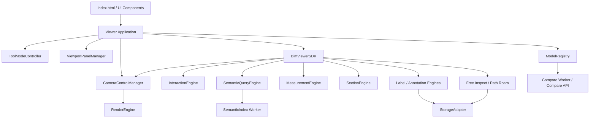

# BIM Viewer 系统优化方案

更新时间：2026-07-16  
文档状态：当前有效，OPT-001 至 OPT-025 以本文件状态表为准。

## 1. 文档信息

| 项目 | 内容 |
|---|---|
| 文档名称 | BIM Viewer 系统优化方案 |
| 适用系统 | BimModelThree Viewer |
| 主要页面 | `/viewer/index.html` |
| 编制日期 | 2026-07-13 |
| 最近更新 | 2026-07-16 |
| 当前阶段 | 功能基本完成，进入稳定化、性能优化和架构收口阶段 |
| 实施原则 | 渐进式优化、保持功能兼容、优先降低回归风险 |

## 2. 优化背景

当前 Viewer 已经完成模型加载、模型树、属性查看、构件选择、测量、剖切、标签、批注、分区可视化、视点管理、自由巡检、路径漫游、模型变换、多模型管理、双视窗版本对比、业务数据接口和第三方 SDK 集成等主要功能。

系统已经具备第一版交付和业务集成基础，后续工作重点应从继续增加功能，转向以下四个方向：

1. 降低工具模式之间的冲突。
2. 提升大模型和多模型场景性能。
3. 收敛页面层与 SDK 的重复实现。
4. 降低后续维护、测试和业务接入成本。

本方案不建议一次性重写 Viewer，而是通过模块抽离、接口兼容和阶段性验收逐步完成优化。

## 3. 当前系统现状

### 3.1 已实现功能范围

| 功能域 | 已实现能力 |
|---|---|
| 模型加载 | Frag 文件、Manifest、URL 加载、加载状态、模型适配 |
| 模型管理 | 追加模型、模型切换、显示隐藏、叠加、错开、复位 |
| 模型树 | 分类 Tab、懒加载、虚拟列表、搜索、详细树 |
| 构件操作 | 点选、框选、定位、隐藏、隔离、透明隔离、着色 |
| 属性查看 | 基础信息、GlobalId、entityName、完整属性 |
| 测量工具 | 捕捉、距离、角度、三角形和多边形面积、撤销 |
| 剖切工具 | 单面剖切、多剖切、剖切盒、拖动调节 |
| 视点能力 | 相机视点保存、恢复、视图浏览器、快照 |
| 漫游能力 | WASD 自由巡检、步进控制、路径漫游、关键帧、多路线 |
| 业务标记 | 标签、批注、状态筛选、气泡样式、位置调整、聚合 |
| 可视化 | 分区着色、隔离、显示隐藏、分组高亮 |
| 模型装配 | 模型平移、旋转、数值设置、本地保存恢复 |
| 版本对比 | 双视窗、视角联动、构件联动、属性与几何差异 |
| 系统集成 | iframe SDK、直接 JavaScript SDK、事件和命令桥接 |

### 3.2 当前代码规模

| 文件 | 当前规模 | 评价 |
|---|---:|---|
| `viewer/index.html` | 642 行 | 页面控件和面板较多 |
| `viewer/main-mvp.js` | 约 12,922 行 | 页面状态和业务逻辑高度集中 |
| `viewer/style.css` | 约 4,158 行 | 视口浮层和响应式覆盖关系复杂 |
| `viewer/app/model-registry.js` | 约 437 行 | 统一模型角色、装配归属、范围、变换、图层和销毁生命周期 |
| `viewer/engines/measurement-engine.js` | 约 1,482 行 | 测量和捕捉已相对独立，交互复杂度较高 |
| `viewer/engines/semantic-query-engine.js` | 约 834 行 | 承担树、属性和语义查询核心职责 |

`main-mvp.js` 当前包含约 106 个顶层状态变量、199 个 DOM 引用，并存在大量渲染、同步和事件处理函数。继续直接增加页面逻辑会显著提高回归风险。

### 3.3 优化任务实施状态

| 编号 | 任务 | 当前状态 | 说明 |
|---|---|---|---|
| OPT-001 | ToolModeController | 已完成 | 测量、捕捉、剖切、巡检、原地转向、框选、气泡调位、模型变换和路径漫游已接入 |
| OPT-002 | 相机控制权管理 | 开发完成，待人工验收 | 页面与直接 SDK 已统一使用 `CameraControlManager`，业务代码不再直接写 `controls.enabled` |
| OPT-003 | ViewportPanelManager | 开发完成，待人工验收 | 路径漫游、模型装配和气泡工具已接入统一面板管理与停靠轨道 |
| OPT-004 | 模式冲突测试矩阵 | 部分完成 | 已有控制器、相机、面板、测量和分区单元测试，仍需完成浏览器人工交互矩阵 |
| OPT-005 | ModelRegistry | 开发完成，待人工验收 | 多模型集合、角色、归属、范围、变换、图层和销毁均由注册表提供；当前/对比对象仅保留为渲染引用 |
| OPT-006 | 模型角色标准化 | 开发完成，待人工验收 | 已统一使用 `primary / managed / compare`，SDK 状态可读取角色列表 |
| OPT-007 | 模型范围统一计算 | 开发完成，待人工验收 | 原始、局部、当前及多模型合并范围已统一进入 ModelRegistry |
| OPT-008 | 模型销毁规则 | 开发完成，待人工验收 | 已统一页面销毁入口并增加重复销毁保护和失败恢复 |
| OPT-009 | SemanticIndex Worker | 开发完成，待人工验收 | Worker 分批建立全量轻量索引，覆盖构件名称、ID、类型和楼层；不可用时回退基础扫描 |
| OPT-010 | 搜索接口统一 | 开发完成，待人工验收 | `SemanticSearchController` 统一树候选、精确 ID、完整索引、有限回退扫描和旧请求取消 |
| OPT-011 | 索引缓存 | 开发完成，待人工验收 | 按 Manifest 模型版本将索引分块保存到 IndexedDB，不可靠版本来源不跨会话复用 |
| OPT-012 | 树查询分页 | 开发完成，待人工验收 | 普通树和虚拟树均按父节点分批展示子节点，虚拟树不再一次压平全部展开后代 |
| OPT-013 | Compare Worker | 开发完成，待人工验收 | Worker 负责 GlobalId 分类及属性、几何指纹差异计算，Fragments 数据读取保留在主线程分批执行 |
| OPT-014 | 差异任务进度与取消 | 开发完成，待人工验收 | 已统一任务状态、阶段进度、耗时、错误和取消原因，取消操作会终止当前 Worker |
| OPT-017 | 页面改为调用 SDK | 开发完成，待人工验收 | 优先功能域已统一进入 Runtime SDK；指针工具保留为页面到独立 Engine 的薄适配 |
| OPT-018 | SDK 事件标准化 | 开发完成，待人工验收 | Runtime、iframe 和直接 SDK 已统一事件版本、标识、来源、载荷及命令生命周期字段 |
| OPT-019 | iframe 与直接 SDK 对齐 | 开发完成，待人工验收 | 已建立可移植接口能力清单，补齐视点、快照、模型树、选择及材质操作差异 |
| OPT-020 | 删除页面重复实现 | 开发完成，待人工验收 | iframe 转发、自由巡检、路径核心、路线文档和播放状态均已共享 |
| OPT-021 | 右侧功能 Tab 化 | 开发完成，待人工验收 | 右栏构件、基础、属性、对比已收拢为固定 Tab；业务抽屉补齐键盘切换和状态记忆 |
| OPT-022 | 业务配置移入设置抽屉 | 开发完成，待人工验收 | 后端同步配置和运行日志已进入独立设置抽屉，业务功能只保留模型业务面板 |
| OPT-023 | CSS 按模块拆分 | 开发完成，待人工验收 | 样式已按基础、核心、抽屉、功能、布局、右栏、响应式和左栏拆成八个有序模块，并保留兼容入口 |
| OPT-024 | 移除兼容隐藏按钮 | 开发完成，待人工验收 | 已删除剖切和面积测量的永久隐藏按钮、冗余事件绑定及兼容样式 |
| OPT-025 | 响应式和浮层验收 | 静态优化完成，待浏览器人工验收 | 已补齐三档主布局、窄屏控件约束和视口浮层避让规则 |

## 4. 主要问题评估

### 4.1 工具模式控制分散

测量、捕捉、框选、自由巡检、原地转向、模型变换、路径漫游和剖切分别维护自身状态，并在多个位置直接修改：

- `controls.enabled`
- 按钮 `active` 状态
- 鼠标样式
- 当前选择高亮
- 其他工具启停状态

这会导致以下问题：

1. 新工具开启时需要手工关闭多个旧工具。
2. 同一状态在多个函数中重复恢复。
3. 容易出现工具切换后高亮消失、相机无法操作或按钮状态错误。
4. 后续增加功能时需要修改多个互不集中的代码位置。

### 4.2 页面控制器过大

`main-mvp.js` 同时负责：

- DOM 查询和事件绑定。
- 模型生命周期管理。
- 模型树渲染。
- 测量和剖切交互。
- 标签、批注和气泡。
- 多模型管理。
- 双视窗和版本差异。
- SDK 命令处理。
- 本地存储。
- 状态栏和日志。

当前结构不利于单元测试，也不利于多人或多 Agent 并行开发。

### 4.3 模型生命周期未统一

系统中存在多种模型角色：

| 模型角色 | 当前用途 |
|---|---|
| 当前模型 | 模型树、属性、选择和业务标记 |
| 追加模型 | 多模型叠加和装配 |
| 对比模型 | 双视窗版本差异 |

这些模型分别由 `managedModels`、`currentModel` 和 `compareModel` 管理，图层、可见性、变换和销毁规则存在交叉，曾出现模型覆盖、错开后消失、切换模型误清理对比模型等问题。

### 4.4 大模型搜索仍存在范围限制

当前已使用懒加载和虚拟列表降低 DOM 数量，但搜索和分组操作仍存在硬限制：

| 项目 | 当前限制 |
|---|---:|
| 树搜索扫描 | 前 1,200 个构件 |
| 搜索结果 | 80 条 |
| 分组选择高亮 | 500 个构件 |
| 虚拟列表启用阈值 | 900 个节点 |
| 树标签批量补充 | 约 450 个节点 |

这些限制能够避免页面卡顿，但也可能导致搜索结果不完整。

### 4.5 版本对比计算成本较高

当前版本对比在前端执行以下操作：

1. 遍历构件并读取 GlobalId。
2. 建立左右模型 GlobalId 索引。
3. 对共同构件读取属性。
4. 读取构件包围盒并计算几何差异。
5. 对差异构件执行高亮。

当前通过扫描上限和超时保护避免页面长期卡住，但最终结果可能属于部分扫描结果。

### 4.6 SDK 与页面层存在重复能力

以下能力在 `main-mvp.js` 和 `BimViewerSDK` 中均存在实现：

- 自由巡检。
- 原地转向。
- 路径漫游和关键帧。
- 视点保存恢复。
- 标签和批注。
- 选择和属性查询。
- 模型加载和相机控制。

两套实现容易出现参数、事件、默认值和行为不一致。

### 4.7 视口浮层布局依赖人工协调

视口中存在以下浮层：

- BIM 工具栏。
- 气泡工具。
- 模型装配面板。
- 路径漫游面板。
- 双视窗提示。
- 模型状态 HUD。

这些浮层主要通过绝对定位、`z-index` 和 CSS 状态选择器控制。功能继续增加后，容易再次产生遮挡和重叠。

### 4.8 本地存储入口分散

漫游、模型变换、气泡样式、业务配置、标签和批注分别维护自己的 `localStorage` 键。当前缺少统一的：

- Schema 版本。
- 数据迁移。
- 容量限制。
- 模型和项目命名空间。
- 后端存储适配。

## 5. 优化目标

### 5.1 架构目标

1. 页面层只负责布局、状态展示和调用控制器。
2. Viewer 功能统一通过 SDK 或 Engine 暴露。
3. 工具模式统一管理，不允许业务函数随意修改相机控制状态。
4. 模型加载、角色、图层、变换和销毁由统一模型注册表管理。
5. 大数据查询和版本对比支持 Worker 或后端执行。

### 5.2 性能目标

| 指标 | 优化目标 |
|---|---|
| 模型树首次可操作时间 | 模型语义数据就绪后 1 秒内 |
| 树节点展开 | 常规分支小于 100ms |
| 构件搜索 | 完整索引查询小于 300ms |
| 工具模式切换 | 小于 100ms，无闪烁 |
| 选择高亮 | 常规选择小于 150ms |
| 版本对比 | UI 不阻塞，可取消，可显示进度 |
| 浮层面板 | 任意分辨率下不重叠 |
| 长时间运行 | 不持续增加事件监听和动画任务 |

### 5.3 维护目标

1. `main-mvp.js` 最终控制在 2,000 至 3,500 行以内。
2. 单个 Controller 建议不超过 800 行。
3. 功能逻辑能够单独测试。
4. SDK 方法、事件和 Viewer 页面行为保持一致。

## 6. 目标架构



## 7. 分阶段优化方案

### 7.1 第一阶段：稳定交互和状态控制

#### 目标

在不改变现有功能入口和操作方式的前提下，先解决模式切换和面板重叠问题。

#### 任务

| 编号 | 任务 | 主要内容 | 当前状态 | 剩余前端工作量 | 难度 |
|---|---|---|---|---:|---|
| OPT-001 | ToolModeController | 统一管理工具模式、兼容关系和退出逻辑 | 已完成 | 0 天 | 中高 |
| OPT-002 | 相机控制权管理 | 统一管理 `controls.enabled` 和鼠标状态 | 开发完成，待人工验收 | 0.5 天 | 中 |
| OPT-003 | ViewportPanelManager | 管理气泡、漫游、装配等视口面板 | 开发完成，待人工验收 | 0.5 天 | 中 |
| OPT-004 | 模式冲突测试矩阵 | 验证捕捉、测量、剖切、巡检、变换组合 | 部分完成 | 1 天 | 中 |

#### 工具模式建议

```text
browse
select
box-select
snap
measure-distance
measure-angle
measure-area
section
free-inspect
ctrl-look
model-transform
path-roam
```

#### 兼容规则示例

| 当前模式 | 可同时启用 | 必须关闭 |
|---|---|---|
| 捕捉 | 距离、角度、面积测量 | 模型变换、路径播放 |
| 自由巡检 | 原地转向 | 测量、框选、模型变换 |
| 原地转向 | 浏览、自由巡检、路径编辑 | 路径播放、模型变换 |
| 模型变换 | 无 | 框选、测量、巡检、路径播放 |
| 路径播放 | 无 | 手动相机、测量、模型变换 |

### 7.2 第二阶段：统一模型生命周期

#### 目标

统一主模型、追加模型和对比模型的管理规则。

#### 任务

| 编号 | 任务 | 主要内容 | 当前状态 | 剩余前端工作量 | 难度 |
|---|---|---|---|---:|---|
| OPT-005 | ModelRegistry | 管理模型角色、状态、图层和变换 | 开发完成，待人工验收 | 0.5 天 | 高 |
| OPT-006 | 模型角色标准化 | `primary`、`managed`、`compare` | 开发完成，待人工验收 | 0.5 天 | 中 |
| OPT-007 | 模型范围统一计算 | 统一叠加、错开、定位和相机适配范围 | 开发完成，待人工验收 | 0.5 天 | 中高 |
| OPT-008 | 模型销毁规则 | 防止误卸载、误隐藏和图层残留 | 开发完成，待人工验收 | 0.5 天 | 中 |

#### 建议数据结构

```javascript
{
    modelId,
    role: "primary" | "managed" | "compare",
    model,
    manifest,
    semanticEngine,
    visible,
    layer,
    transform,
    originalBounds,
    currentBounds,
    loadedAt
}
```

### 7.3 第三阶段：模型树和语义查询优化

#### 目标

取消依赖前 1,200 个构件的搜索方式，实现完整、快速的模型树搜索。

#### 任务

| 编号 | 任务 | 主要内容 | 当前状态 | 剩余前端工作量 | 后端工作量 | 难度 |
|---|---|---|---|---:|---:|---|
| OPT-009 | SemanticIndex Worker | 在 Worker 中建立轻量构件索引 | 开发完成，待人工验收 | 0.5 天 | 0 天 | 中高 |
| OPT-010 | 搜索接口统一 | 支持 entityName、GlobalId、类型和楼层 | 开发完成，待人工验收 | 0.5 天 | 0 天 | 中 |
| OPT-011 | 索引缓存 | 按模型版本保存索引缓存 | 开发完成，待人工验收 | 0.5 天 | 0 天 | 中 |
| OPT-012 | 树查询分页 | 对大分组按页加载 localId | 开发完成，待人工验收 | 0.5 天 | 0 天 | 中 |

#### 建议索引字段

```text
localId
GlobalId
entityName
category
className
storey
objectType
predefinedType
searchText
```

#### OPT-009 当前实现

- 主线程按批次提取结构化语义数据，Worker 不接收模型对象或几何数据。
- Worker 按模型建立全量索引，搜索结果按 ID 精确匹配、名称匹配和其他字段匹配排序。
- 索引构建期间定期让出渲染帧；切换或清理模型时通过构建版本号取消旧任务。
- Worker 不可用时使用内存实现；Worker 运行中故障时清除失效状态，当前模型恢复前 1,200 个构件的基础扫描。

#### OPT-010 当前实现

- `SemanticSearchController` 统一合并模型树候选、精确 `localId`、Worker 索引和有限回退扫描。
- 查询结果按 `localId` 去重；完整索引就绪后不再执行前 1,200 个构件扫描。
- 页面输入变化或模型切换时，旧查询通过取消判断停止，避免过期结果覆盖当前结果。
- 控制器不依赖 DOM，后续 iframe 与直接 SDK 可复用同一查询规则。

#### OPT-011 当前实现

- 缓存键由缓存 Schema、Manifest Schema、`modelId` 和 `modelVersionId` 共同组成，任一版本变化都会生成新缓存。
- 索引按约 1,920 个构件一块写入 IndexedDB，避免一次性复制完整索引造成明显内存峰值。
- 第二次加载同一模型版本时按块恢复到 Worker；构件总数不一致、缓存未完成或分块损坏时自动清理并重建。
- 直接 Frag、Buffer 和缺少 `modelVersionId` 的 Manifest 不启用持久缓存，避免错误复用旧模型数据。
- IndexedDB 不可用时退化为当前页面会话内存缓存；缓存失败不阻断模型加载和基础搜索。
- Viewer 聚合状态新增 `semanticIndexCache.status`，可识别 `disabled / checking / restoring / hit / writing / stored / read-failed / write-failed`。

#### OPT-012 当前实现

- 普通模型树保留现有每批 180 个子节点的懒加载入口。
- 虚拟模型树新增 `TreeQueryPager`，每个父节点独立记录已展示数量，只将当前页加入可见行数组。
- 展开大分组后通过“加载更多节点”逐页增加行；折叠和再次展开保留该父节点当前页进度。
- 切换模型树 Tab 或重新渲染树时重置分页状态，避免旧树页码污染新树。
- 全部展开操作仍限制每次最多展开 120 个节点，同时受子节点分页约束。

### 7.4 第四阶段：版本对比性能优化

#### 目标

版本对比不阻塞主线程，并支持完整对比、进度、取消和缓存。

#### 可选实现路径

| 路径 | 实现方式 | 优点 | 缺点 | 建议 |
|---|---|---|---|---|
| Web Worker | 前端 Worker 读取索引并计算差异 | 部署简单 | 仍需下载完整数据 | MVP 优先 |
| 后端对比 | 后端根据模型版本生成差异报告 | 完整、可缓存 | 需要后端任务系统 | 正式版本推荐 |
| 转换期指纹 | 转换时生成属性和几何 Hash | 对比速度最快 | 需要调整转换流程 | 长期推荐 |

#### 建议指纹字段

```text
GlobalId
propertyHash
geometryHash
boundingBox
entityName
category
```

#### 任务

| 编号 | 任务 | 当前状态 | 剩余前端工作量 | 后端工作量 | 难度 |
|---|---|---|---:|---:|---|
| OPT-013 | Compare Worker | 开发完成，待人工验收 | 0.5 天 | 0 天 | 高 |
| OPT-014 | 差异任务进度与取消 | 开发完成，待人工验收 | 0.5 天 | 0 天 | 中 |
| OPT-015 | 转换期构件指纹 | 未开始 | 1.5 天 | 4 天 | 高 |
| OPT-016 | 差异报告缓存接口 | 未开始 | 1 天 | 3 天 | 中高 |

#### OPT-013 当前实现

- `VersionCompareController` 优先创建模块 Worker，Worker 不可用或运行失败时使用相同核心算法回退。
- GlobalId 集合匹配、共同构件、左侧缺失和右侧新增分类均在 Worker 中执行。
- 主线程按每批 20 个共同构件读取属性和包围盒，生成纯结构化指纹后交给 Worker 判断属性与几何变化。
- 每个构件最多传递 400 个标准化属性字段，不发送 Fragments 模型对象、原始错误信息或不可序列化对象。
- 几何比较继续使用中心、尺寸、体积及原有绝对/相对容差，保持现有差异展示和高亮结构。
- 点击取消或清除右侧模型会终止当前 Worker，请求以 `VERSION_COMPARE_ABORTED` 结束。

#### OPT-014 当前实现

- `VersionCompareTaskController` 统一维护 `idle / running / completed / cancelled / failed` 状态。
- GlobalId 索引、GlobalId 分类和指纹差异检测分别记录阶段进度，阶段内包含当前数、总数和百分比。
- 任务状态记录主模型、对比模型、已发现变更数、开始/结束时间、总耗时、错误和取消原因。
- 用户点击取消时记录 `user`；清除右侧模型时记录 `model-cleared`；异常中止和执行失败分别进入取消或失败状态。
- Viewer 聚合状态新增 `versionCompareTask` 和 `versionCompareWorkerMode`，iframe SDK 可通过现有 `getState()` 查询。
- 完成状态栏追加本次对比耗时，开始下一次对比会创建新的任务编号并重置旧进度。

### 7.5 第五阶段：SDK 和页面逻辑统一

#### 目标

以共享 Controller 和 Engine 作为唯一功能实现入口，`main-mvp.js` 只负责组织 UI，`ViewerRuntimeSDK` 和 `BimViewerSDK` 复用相同实现。页面不得直接实例化第二套 `BimViewerSDK`，避免重复创建 Canvas、Renderer 和 FragmentsModels。

#### 优先迁移模块

1. 自由巡检和原地转向。
2. 路径漫游和关键帧。
3. 视点保存和恢复。
4. 标签和批注。
5. 选择、隐藏、隔离和着色。
6. 多模型和版本对比。

#### 任务

| 编号 | 任务 | 当前状态 | 剩余前端工作量 | 难度 |
|---|---|---|---:|---|
| OPT-017 | 页面改为调用 SDK | 开发完成，待人工验收 | 0.5 天 | 高 |
| OPT-018 | SDK 事件标准化 | 开发完成，待人工验收 | 0.5 天 | 中 |
| OPT-019 | iframe 与直接 SDK 对齐 | 开发完成，待人工验收 | 0.5 天 | 中 |
| OPT-020 | 删除页面重复实现 | 开发完成，待人工验收 | 0.5 天 | 中高 |

#### OPT-017 当前实现

- 新增 `ViewerRuntimeSDK`，以注入命令处理器的方式复用页面现有 Engine，不创建第二套 Canvas、Renderer 或 FragmentsModels。
- 页面“适配模型”、标准视图、定位、隐藏、隔离、着色和显示全部按钮已改为调用 Runtime SDK。
- iframe 的相机、视点、选择、GlobalId 选择、属性查询和基础构件命令已调用同一 Runtime SDK。
- 自由巡检启停、移动步进和状态查询已迁移，Runtime SDK 继续调用原有 ToolModeController 接入函数。
- 路径漫游面板、路线增删切换、关键帧增删改排、恢复、重新捕获、播放、暂停、停止和速度控制已迁移。
- 页面漫游按钮与 iframe 漫游命令现在只负责向 Runtime SDK 转发，不再重复组装返回状态。
- 标签新增/编辑表单、业务创建、列表、删除和气泡定位已迁移，最终仍由 `LabelStoreEngine` 保存数据。
- 批注新增/编辑表单、业务创建、更新、列表、历史、删除、状态切换和气泡定位已迁移，最终仍由 `AnnotationEngine` 保存数据。
- 页面表单使用 `saveLabelForm / saveAnnotationForm`，iframe 使用 `createLabel / createAnnotation`，避免把 UI 表单语义混入第三方接口。
- 气泡调位置继续由 Bubble Relocate 工具模式控制，位置写入仍进入原 Store Engine，不在 Runtime SDK 中复制指针状态。
- 模型加载、追加、模型列表、当前模型切换、定位、显隐和卸载已迁移，生命周期仍由 `ModelRegistry` 和原加载入口管理。
- 多模型叠加、错开和复位已迁移，Runtime SDK 不直接修改模型集合或 Fragments 内部对象。
- 右侧版本加载、清除、运行/取消对比、视角联动和对比状态查询已迁移，继续复用 Compare Worker 与任务控制器。
- iframe `openModel` 现在转发到同一 Runtime SDK，仍保留 `modelLoaded / modelLoadFailed` 事件完成请求的兼容行为。
- 快照、保存/恢复最近视点、视图浏览器列表、新增、编辑、恢复和删除已迁移，继续由 `SnapshotEngine / ViewpointEngine / ViewStoreEngine` 实现。
- 页面仅保留视图名称、分类表单和列表 DOM；视图数据变更统一通过 Runtime SDK 命令执行。
- `getState()` 返回 Runtime SDK 已注册命令列表，便于集成层判断当前页面能力。
- Runtime SDK 已导出到稳定 SDK 入口，但仅作为现有 Viewer 运行时适配工具；第三方初始化仍使用 `BimViewerEmbedClient` 或 `BimViewerSDK`。
- 测量、剖切、模型变换等连续指针工具保留页面到独立 Engine 的薄适配，工具状态仍由 ToolModeController 统一，不重复业务数据实现。

#### OPT-018 当前实现

- 新增 `sdk-event-contract.js`，定义 `bim-viewer-sdk-event/v1` 事件版本和统一事件构造函数。
- 所有事件附加 `schemaVersion / eventId / event / source / timestamp / payload`，旧业务字段仍保留在顶层。
- Runtime 命令事件附加统一 `commandId / command / status / startedAt / finishedAt / durationMs / result / error`。
- 同一次 Runtime 命令的开始、完成、失败共用 `commandId`；iframe 优先复用宿主请求的 `requestId`。
- iframe 的命令响应及 `ready / modelLoaded / selectionChanged / state` 等业务事件统一附加标准元数据。
- 直接 `BimViewerSDK` 的模型、选择、巡检、漫游、标签、批注和业务同步事件统一通过 `emitSdkEvent()` 发出。
- 事件名及原有字段保持兼容；异常统一为可序列化的 `{name, message, code?}`，Runtime 额外保留 `originalError`。
- 新增事件协议、Runtime 生命周期及 iframe Bridge 自动化测试。

#### OPT-019 当前实现

- 新增 `sdk-integration-contract.js`，定义 `bim-viewer-sdk-integration/v1` 和跨入口可移植方法分组。
- iframe 与直接 SDK 均提供 `getCapabilities()`；通用方法和集成专属扩展分开返回。
- 统一 `setViewpoint / restoreViewpoint`、`snapshot / takeSnapshot` 兼容名称，不移除旧方法。
- iframe 新增 `getTree(mode)` 和 `getSelection()`；模型树命令已贯通 Client、Bridge 白名单、Runtime SDK 和页面 handler。
- `getItemInfo` 统一支持数字 localId、字符串 GlobalId 及对象参数，直接 SDK 可通过 GlobalId 解析 localId。
- iframe 隔离命令支持 `hide / dim / opacity` 参数，颜色命令支持指定颜色，不再只调用页面默认值。
- iframe 补齐 `setSelectedOpacity()` 和 `resetSelectedMaterial()`，与直接 SDK 的构件材质操作一致。
- Viewer `ready.supports` 改为复用 Bridge 的 `SUPPORTED_COMMANDS`，避免手写能力列表漂移。
- 保留现有返回字段；iframe 方法均可 `await`，直接 SDK 的同步结果也允许通过 `await` 统一调用。

人工验收重点：

1. 两种入口 `getCapabilities()` 的 `methods` 相同，`integration / extensions` 符合实际入口。
2. iframe 分别读取 `models / classes / storeys` 模型树，结果与直接 SDK 一致。
3. iframe 依次验证半透明隔离、指定颜色、透明度设置和材质重置。
4. 两种入口分别验证 `restoreViewpoint()` 与 `takeSnapshot()` 兼容名称。

#### OPT-020 当前实现

- 新增 `runtime-embed-handlers.js`，统一生成 iframe Bridge 到 Runtime SDK 的命令适配器。
- Viewer 页面删除逐项手写的 iframe handler 和 `runIframeRuntimeCommand()`，Bridge 绑定缩减为一个工厂调用。
- 适配器根据 `SUPPORTED_COMMANDS` 自动生成完整 handler 集合，新增命令后不会遗漏 Viewer 端转发。
- `openModel / snapshot` 仍保留专用事件完成宿主 Promise；普通命令统一调用 `ViewerRuntimeSDK.execute()`。
- `selectLocalIds / selectGlobalIds` 的来源字段和 `stopPathRoam.reset` 默认值集中归一化。
- 页面材质重置和透明度滑条改为 Runtime SDK 命令，不再绕过统一入口直接调用页面函数。
- 新增命令覆盖、参数转发、上下文追踪和特殊生命周期测试。
- 新增 `FreeInspectController`，统一自由巡检可用状态、速度约束、WASD/Shift 按键、动画循环和相机平移。
- `/viewer/index.html` 删除原有按键集合、帧状态、移动向量计算和键盘处理函数，仅保留 ToolModeController 与 UI 同步。
- 直接 `BimViewerSDK` 删除同一套键盘、帧循环和移动实现，改为复用 `FreeInspectController`，继续保留 `freeinspectchange` 公开事件。
- 页面模型清理、工具冲突退出及直接 SDK 的模型加载、关闭、路径播放、销毁仍会通过原入口关闭自由巡检。
- 自由巡检新增速度约束、模型可用性、WASD 移动和表单输入忽略测试。
- 新增 `path-roam-core.js`，统一 `bim-path-roam/v1` Schema、路线/关键帧 ID、相机状态校验和路线归一化。
- 页面与直接 SDK 的关键帧时间排序、最小时间间隔、相机插值、总时长和待触发关键帧判断改为共享核心。
- 删除直接 SDK 顶部重复的路径 Schema、ID、相机、路线、关键帧和插值函数；页面对应函数缩减为本地化名称与相机默认值适配。
- 路径核心新增相机校验、无效关键帧过滤、时间线约束、非零起点插值和关键帧触发测试。
- 新增 `PathRoamDocumentController`，统一多路线文档、活动路线、关键帧 CRUD、旧单路线迁移和 localStorage 持久化。
- 页面与直接 SDK 均改为调用共享文档 Controller；原入口只保留中文/英文提示、SDK 事件、UI 列表和相机/选择恢复。
- 关键帧新增、编辑、重新捕获、排序、删除、清空以及路线新增、切换、重命名、删除不再各自维护两套实现。
- 文档 Controller 对受限存储环境自动回退为内存状态，不阻断路径漫游。
- 路线文档新增生命周期、关键帧 CRUD/时间约束和旧数据迁移测试。
- 新增 `PathRoamPlaybackController`，统一播放、暂停、停止、倍速时间累计、RAF 循环和关键帧单次触发状态。
- 页面播放回调继续负责 ToolModeController、HUD、状态文案和模型覆盖层同步，不再维护独立播放时钟。
- 直接 SDK 播放回调继续负责相机锁、`pathroamchange` 事件和模型刷新，不再维护独立 RAF 与关键帧触发集合。
- 路线切换、删除、清空和模型加载时同步重置共享播放时间，避免旧路线进度污染新路线。
- 播放 Controller 新增可用性、插值完成、倍速暂停和关键帧去重测试。

人工验收重点：

1. 页面与直接 SDK 分别执行路线新增、切换、编辑、删除和旧路线读取。
2. 分别验证播放、暂停、继续、停止、倍速和自动完成，相机锁及 HUD 状态能够恢复。
3. 路径播放跨越关键帧时，选择和模型变换状态只应用一次。
4. 路径播放与自由巡检、框选、模型变换连续切换时不存在残留按键或动画帧。

### 7.6 第六阶段：UI 和样式收口

#### 目标

降低信息密度和浮层冲突，形成稳定的 Viewer 操作布局。

#### 建议布局

- 左侧：模型状态、多模型列表、模型树。
- 中间：模型视口和上下文工具。
- 右侧：属性、批注、标签、视图、分区、对比 Tab。
- 设置抽屉：业务接口、本地配置和调试日志。

#### 任务

| 编号 | 任务 | 当前状态 | 剩余前端工作量 | 难度 |
|---|---|---|---:|---|
| OPT-021 | 右侧功能 Tab 化 | 开发完成，待人工验收 | 0.5 天 | 中 |
| OPT-022 | 业务配置移入设置抽屉 | 开发完成，待人工验收 | 0.5 天 | 中 |
| OPT-023 | CSS 按模块拆分 | 开发完成，待人工验收 | 0.5 天 | 中 |
| OPT-024 | 移除兼容隐藏按钮 | 开发完成，待人工验收 | 0.5 天 | 低 |
| OPT-025 | 响应式和浮层验收 | 静态优化完成，待浏览器人工验收 | 0.5 天 | 中 |

#### OPT-021 当前实现

- 第三列改为固定右栏，`构件 / 基础 / 属性 / 对比` 四个面板共用同一内容区域，不再分别争抢页面高度。
- 版本对比开始时自动切换到“对比”Tab；未加载对比版本时展示明确空状态。
- 业务功能入口固定在右栏标题区，`视图 / 分区 / 批注 / 标签` 抽屉继续保持无模型遮罩设计。
- 两组 Tab 均支持方向键、`Home`、`End` 切换，活动项使用标准 `aria-selected / aria-controls / tabpanel` 关系。
- 右栏和业务抽屉分别记忆最后活动的 Tab；状态逻辑提取为 `TabStateController`，已覆盖边界回退和循环导航测试。

人工验收重点：

1. 桌面宽度下右栏四个 Tab 无文字重叠，内容区仅显示一个活动面板。
2. 选择构件后，构件操作、基础信息和完整属性在对应 Tab 中保持同步。
3. 加载两个版本并点击“对比”后，右栏自动切至对比结果且筛选列表可用。
4. 从任意右栏 Tab 打开业务功能，抽屉外模型仍可交互，关闭后焦点返回入口。
5. Tab 获得焦点后，方向键及 `Home / End` 可循环切换，刷新页面后恢复上次活动项。

#### OPT-022 当前实现

- 右栏标题区拆分为“业务”和“设置”两个固定入口，业务面板不再混放接口配置。
- 设置抽屉提供 `业务接口 / 运行日志` 两个 Tab，统一承载同步模式、接口地址、业务上下文、自动同步选项、快照同步及调试日志。
- 运行日志从左栏移除，模型树扩展到原日志区域，增加大模型树的可用高度。
- 业务抽屉与设置抽屉互斥；切换入口时旧抽屉自动关闭，抽屉外模型区域保持可交互。
- 设置 Tab 复用 `TabStateController`，支持方向键、`Home / End`、活动项记忆、`Esc` 关闭及入口焦点恢复。

人工验收重点：

1. 点击“业务”只显示视图、分区、批注和标签，不再出现同步配置。
2. 点击“设置”可切换业务接口与运行日志，原有同步、拉取、推送和清空日志操作保持有效。
3. 业务抽屉打开时点击“设置”，以及设置抽屉打开时点击“业务”，页面始终只保留一个抽屉。
4. 抽屉打开后模型区域无遮罩且仍可旋转、缩放和选择，按 `Esc` 可关闭当前抽屉。
5. 左侧模型树占用原日志区域；移动端恢复自然文档流，不产生空白网格行。

#### OPT-023 当前实现

- 将原 `style.css` 的 4366 行样式按原级联顺序拆成六个基础模块，后续追加最终响应式和左栏模块，当前共八个模块。
- `index.html` 直接按顺序加载八个 CSS 文件，避免通过 `@import` 产生串行请求。
- 根目录 `style.css` 保留为旧集成兼容聚合入口，新页面不再直接依赖单体样式文件。
- 新增 `styles/README.md`，明确模块职责、加载顺序和维护约束。
- 拆分前后总字节数、总行数及 SHA-256 完全一致；新增测试锁定页面链接和兼容入口的模块顺序。

人工验收重点：

1. 主页面加载时六个 CSS 请求均成功，不出现 404 或无样式闪烁。
2. 桌面三栏、右栏 Tab、业务/设置抽屉及视口工具栏与拆分前一致。
3. 760px 以下移动布局、620px 以下全宽抽屉保持正常。
4. 旧集成继续引用 `style.css` 时，样式与直接加载模块一致。
5. 后续新增样式按 `styles/README.md` 的职责进入对应模块，不再向聚合入口写业务选择器。

#### OPT-024 当前实现

- 删除 8 个旧剖切隐藏按钮：加面、切面、剖切盒、X/Y/Z 轴和正负微调。
- 删除永久隐藏的“完成面积”按钮；面积测量仍通过模型区双击完成。
- 剖切统一使用 `剖切模式 / 当前切面 / 位置滑条`：模式负责轴向、多剖切和剖切盒，切面下拉负责新增与切换，滑条负责位置。
- 同步移除旧按钮的 DOM 查询、禁用/选中状态、事件绑定，以及仅供旧按钮使用的切面轮换、轴向按钮和正负微调函数。
- 删除 `.compatHidden` 样式并新增 DOM 契约测试，防止旧按钮和兼容选择器回流。

人工验收重点：

1. BIM 工具栏无不可见占位或异常间距，测量、角度、面积、标签和剖切入口保持可用。
2. 剖切模式可切换单面 X/Y/Z、多剖切和剖切盒。
3. 多剖切可从“当前切面”下拉新增切面并切换已有切面。
4. 位置滑条可连续调整当前切面，清剖切后恢复模型。
5. 面积测量选择至少三个点后双击完成，结果和单位正常显示。

#### OPT-025 当前实现

- 新增最后级联的 `07-responsive-overlays.css`，集中管理最终断点和浮层避让，避免继续在旧模块中叠加覆盖。
- 主布局划分为标准三栏、紧凑三栏和单栏：`>1280px`、`1021–1280px`、`≤1020px`，修复原 `761–1020px` 强制三栏造成的横向裁切。
- 单栏模式固定顺序为品牌、加载区、模型视口、模型状态、多模型、模型树和右栏信息，模型视口不再排到所有管理面板之后。
- `≤760px` 收紧页面间距并约束加载区、HUD、测量结果和双视窗提示；`≤520px` 将 BIM 工具按钮改为三列并隐藏次要双视窗说明。
- 视口面板打开时隐藏底部 HUD，防止路径漫游、模型装配和气泡面板覆盖状态信息；低高度视口单独压缩工具停靠区。
- 增加减少动画偏好支持，并新增断点、布局顺序、浮层避让和 CSS 加载顺序契约测试。
- 左栏桌面宽度调整为 300px、紧凑三栏调整为 280px；品牌区填满首行，不再留下大块空白。
- 模型状态改为单行四格，验证区压缩；多模型标题和操作分行，空状态居中；模型树标题、Tab、搜索和内容固定为单列四行，消除隐式列和横向溢出。

浏览器人工验收矩阵：

| 视口 | 预期布局 | 重点检查 |
|---|---|---|
| `≥1281px` | 标准三栏 | 左栏状态、多模型、模型树完整，中模型与右信息无重叠 |
| `1021–1280px` | 紧凑三栏 | 左栏标题和树 Tab、加载区文字、右栏 Tab、模型工具栏不溢出 |
| `761–1020px` | 单栏 | 模型视口位于加载区后，无横向滚动 |
| `521–760px` | 移动单栏 | HUD 三列、全宽抽屉、工具栏可滚动 |
| `≤520px` | 窄屏单栏 | BIM 工具三列、双视窗说明和右栏标题不重叠 |
| 高度 `≤700px` | 低高度视口 | 工具停靠区和视口面板可滚动且不遮挡退出按钮 |

人工验收还需依次打开路径漫游、模型装配、气泡工具、业务抽屉、设置抽屉和双视窗，检查模型选择、旋转、缩放仍可操作。本轮因浏览器调用会导致 Codex App 闪退，未执行浏览器截图和像素级验收。

### 7.7 第七阶段：存储与测试体系

#### 目标

统一持久化方式，并建立可重复执行的回归测试。

#### StorageAdapter

```javascript
storage.get(namespace, key)
storage.set(namespace, key, value)
storage.remove(namespace, key)
storage.list(namespace)
storage.migrate(namespace, fromVersion, toVersion)
```

支持实现：

- LocalStorageAdapter。
- IndexedDbAdapter。
- BusinessApiAdapter。

#### 测试范围

| 测试类型 | 测试内容 |
|---|---|
| 单元测试 | Engine、Controller、数据转换、模式兼容规则 |
| 集成测试 | 模型加载、选择、测量、剖切、标签和漫游 |
| 性能测试 | 大模型树、搜索、批量高亮、版本对比 |
| UI 测试 | 面板重叠、文字溢出、不同分辨率 |
| SDK 测试 | iframe 命令、事件、超时和错误返回 |

## 8. 总体排期建议

以下时间按开发者与 AI 协作方式估算，不拆分传统开发时间和 AI 时间。

| 阶段 | 主要目标 | 前端时间 | 后端时间 | 建议周期 |
|---|---|---:|---:|---|
| 第一阶段 | 模式和面板稳定化 | 8.5 天 | 0 天 | 2 周 |
| 第二阶段 | 模型生命周期统一 | 7.5 天 | 0 天 | 1.5 周 |
| 第三阶段 | 模型树和语义索引 | 8.5 天 | 1 天 | 2 周 |
| 第四阶段 | 版本对比优化 | 7.5 天 | 7 天 | 2 至 3 周 |
| 第五阶段 | SDK 和页面统一 | 10 天 | 0 天 | 2 周 |
| 第六阶段 | UI 和 CSS 收口 | 9.5 天 | 0 天 | 2 周 |
| 第七阶段 | 存储和测试体系 | 6 天 | 2 天 | 1.5 周 |

建议不要串行执行全部阶段。第三阶段的语义索引、第四阶段的后端指纹和第六阶段的 UI 整理可以在模块边界确定后并行推进。

## 9. 推荐优先级

### P0：立即实施

1. ToolModeController。
2. 相机控制权统一。
3. ViewportPanelManager。
4. 模式冲突测试矩阵。
5. ModelRegistry 设计和接入。

### P1：性能与完整性

1. SemanticIndex Worker。
2. 完整模型树搜索。
3. Compare Worker。
4. 统一渲染刷新调度。
5. 大模型性能基线。

### P2：架构收口

1. 页面统一调用 SDK。
2. iframe 与直接 SDK 对齐。
3. StorageAdapter。
4. 右侧面板 Tab 化。
5. CSS 模块拆分。

## 10. 实施风险与控制措施

| 风险 | 影响 | 控制措施 |
|---|---|---|
| 大规模拆分引发功能回归 | 高 | 分模块迁移，每次只迁移一个功能域 |
| SDK 行为与旧页面不一致 | 高 | 保留兼容适配层，增加契约测试 |
| 多模型生命周期调整导致模型消失 | 高 | 建立模型角色状态表和销毁测试 |
| Worker 无法直接访问模型对象 | 中 | Worker 只处理结构化索引和指纹数据 |
| 版本对比结果与旧逻辑不一致 | 中高 | 同一模型执行双算法比对并保留报告 |
| UI 重构影响用户习惯 | 中 | 保持按钮名称和主要操作位置稳定 |
| 本地存储迁移导致数据丢失 | 高 | Schema 版本化，迁移前备份旧数据 |

## 11. 验收标准

### 11.1 第一阶段验收

- 任意工具切换后不存在相机锁死。
- 测量、框选、巡检、变换和路径播放符合兼容矩阵。
- 选中构件高亮不会因模式切换异常消失。
- 视口面板不会互相遮挡。
- 活动工具显示快速退出按钮，点击按钮或按 `Esc` 后恢复浏览状态且不清除构件选择。

当前自动化回归结果：模型注册表、模型范围、模型销毁、相机控制权、工具模式、视口面板、测量捕捉、分区隔离、语义索引、统一搜索、索引缓存、树查询分页、版本对比 Worker、差异任务状态、Runtime SDK、事件协议、iframe Bridge、SDK 集成契约、Runtime iframe 适配器、自由巡检 Controller、路径漫游核心、路线文档、播放 Controller、Tab 状态控制、CSS 模块契约、兼容控件清理、响应式布局和左栏布局契约共 109 项测试通过。浏览器人工验收仍需重点验证“测量 → 框选 → 巡检 → 模型变换 → 路径漫游”的连续切换、Ctrl 原地转向结束后的相机恢复，以及六档视口矩阵下的布局与浮层避让。

### 11.2 模型管理验收

- 两个及以上模型可以同时显示。
- 叠加、错开和复位后模型仍在相机范围内。
- 主模型、装配模型和对比模型分别保存原始范围与当前范围，模型变换后当前范围同步更新。
- 切换当前模型不会误卸载其他模型。
- 清除对比模型不会影响多模型列表。
- 装配模型临时作为对比版本时仍保留装配归属，清除对比后可继续执行叠加、错开和切换。
- 模型图层和 `initial / current / overlay` 变换状态由注册表统一记录，版本对比结束后图层恢复为主场景图层。
- 连续点击卸载或并发触发清理时，同一模型只执行一次实际销毁；销毁失败后恢复为可操作状态。

### 11.3 性能验收

- 大模型树展开保持可操作。
- 完整索引就绪后，搜索范围覆盖模型全部 `localId`，不再受前 1,200 个构件限制。
- 索引构建期间相机和基础构件选择保持可操作，并显示已索引数量和总数。
- 索引构建期间切换模型，旧模型任务停止且不会污染新模型搜索结果。
- Worker 不可用或运行中失败时页面不崩溃，搜索回退到基础扫描范围。
- 首次通过 Manifest 加载模型后缓存状态变为 `stored`；刷新并再次加载相同版本时变为 `hit`，且搜索结果一致。
- 修改 Manifest 的 `modelVersionId` 后不读取旧缓存，并重新构建新版本索引。
- 直接加载 Frag 文件时缓存状态为 `disabled`，不会错误命中其他同名文件缓存。
- 大模型虚拟树展开超过 180 个直接子节点的分组时，先显示首批节点和“加载更多节点”，滚动与相机操作保持可用。
- 连续加载更多只增加当前父节点的可见数量，不影响其他分组的分页状态；切换 Tab 后从首批节点重新开始。
- 对比过程按指纹批次显示已扫描数和已发现变更数，点击取消后按钮和状态立即恢复。
- 对比取消或清除右侧模型后，旧 Worker 结果不能覆盖当前状态；重新对比可创建新 Worker 并正常完成。
- 同一组模型使用 Worker 与无 Worker 回退算法时，新增、缺失、属性变化和几何变化分类保持一致。
- 对比运行时调用 `getState()`，`versionCompareTask.status` 为 `running`，且阶段进度持续更新；完成后状态为 `completed` 并保留耗时。
- 用户取消后 `cancelReason` 为 `user`；对比过程中清除右侧模型后为 `model-cleared`，两种情况均不再接收旧结果。
- 对比和搜索期间页面相机仍可操作。

### 11.4 SDK 验收

- 页面功能和 SDK 功能使用同一实现。
- iframe SDK 与直接 SDK 方法语义一致。
- 所有公开方法有注释、参数和返回值定义。
- 事件包含稳定的模型、选择和状态数据。

## 12. 建议的第一批实施任务

第一批建议只实施以下四项，不同时进行大规模 UI 重构：

1. `[已完成]` 新建 `app/tool-mode-controller.js`。
2. `[已完成]` 将测量、框选、巡检、原地转向和模型变换接入模式控制器。
3. `[已完成开发]` 新建 `app/camera-control-manager.js`，统一页面和直接 SDK 的相机控制权与鼠标状态。
4. `[已完成开发]` 新建 `app/viewport-panel-manager.js`，统一主面板互斥、气泡面板展开状态和视口停靠布局。
5. `[进行中]` 补充模式兼容和退出行为测试清单。

第一批交互优化、模型注册表、第三阶段及 `OPT-013 / OPT-014 / OPT-017 / OPT-018 / OPT-019 / OPT-020 / OPT-021 / OPT-022 / OPT-023 / OPT-024` 已完成开发；`OPT-025` 已完成静态优化，等待浏览器人工验收。第六阶段 UI 和 CSS 收口开发结束，下一阶段为 `StorageAdapter` 与测试体系收口。
