# BIM Three.js + Fragments 架构功能扩展与需求可行性评估

更新时间：2026-06-23

## 1. 文档目的

本文档用于评估当前 `Three.js + Fragments` 技术架构下，BIM Viewer 后续可以扩展哪些功能，以及截图需求清单中的功能在当前架构下是否可实现、实现难度有多大。

当前投入约束：只投入 `1 名前端 + 1 名后端`，并在 AI 协作下推进。后续工作量、周期、任务拆分均按该人员配置估算；测试、产品确认和 BIM 数据校验需要前后端兼顾，并由业务侧按节点参与验收。

当前验证链路：`IFC -> Fragments IfcImporter / 转换服务 -> .frag 模型文件 -> Three.js + @thatopen/fragments 前端渲染 -> 业务 UI / 模型树 / 属性面板 / 构件操作 / 批注等`。

当前 MVP 项目位置：`E:\xeokit-bim-viewer\fragments-convert-poc`。当前核心依赖：

```json
{
  "@thatopen/fragments": "3.4.5",
  "three": "0.182.0",
  "web-ifc": "0.0.77"
}
```

## 2. 评估标准

| 类型 | 等级 | 含义 |
|---|---|---|
| 可行性 | 高 | 当前架构天然支持，已有 API 或已实现基础能力 |
| 可行性 | 中高 | 当前架构可支持，但需要补业务封装、交互设计或性能优化 |
| 可行性 | 中 | 技术上可做，但需要较多自研逻辑 |
| 可行性 | 中低 | 可做但成本高，且依赖外部数据质量、坐标配准或复杂业务规则 |
| 可行性 | 低 | 当前架构不适合，建议引入专门工具或调整技术路线 |
| 难度 | 低 | 1-3 天内可完成基础版本 |
| 难度 | 中 | 需要 1-2 周完成稳定版本 |
| 难度 | 高 | 涉及多模块配合、性能、数据结构或复杂交互 |
| 难度 | 很高 | 涉及复杂算法、外部系统、坐标体系或产品级工程化 |

---

# 第一部分：需求功能可行性评估

## 3. 需求清单来源

本部分基于截图中的需求表格进行评估，分类包括：模型视角、基础功能、模型装配、构件操作、标签管理。

## 4. 需求功能可行性总表

| 分类 | 功能 | 当前状态 | 可行性 | 实现难度 | 实现来源 | 推荐实现方式 | 风险 / 备注 |
|---|---|---|---:|---:|---|---|---|
| 模型视角 | 设置相机位置 | 已实现基础 | 高 | 低 | 调用 Three.js API + 少量封装 | Three.js Camera + OrbitControls | 可封装成统一 API |
| 模型视角 | 视角切换 | 已实现 | 高 | 低 | 调用 Three.js API + 项目封装 | 前、后、左、右、顶、底、等轴测 | 当前 MVP 已有 |
| 基础功能 | 捕捉 | 未实现 | 中高 | 中 | 优先调用 Fragments API，必要时补交互封装 | Fragments `snapRaycast()` + Three.js 辅助点 | 建议作为测量前置能力 |
| 基础功能 | 路径漫游 | 未实现 | 中高 | 中 | 插件/库 + 自研业务封装 | GSAP / Tween + Camera 路径点 + 动画时间轴 | 需要路径编辑、播放、暂停、速度控制 |
| 基础功能 | 右键菜单 | 已实现初版 | 高 | 低 | 调用 Fragments API + 自研 UI | Fragments `raycast()` + 自定义菜单 | 需验证不同模型下命中准确性 |
| 基础功能 | 模型批注 | 未实现 | 高 | 中 | 主要自研业务功能 | `GlobalId + cameraState + note` | 展示可复用标签/快照能力，数据结构和接口需自研 |
| 基础功能 | 多功能剖切 | 未实现 | 中高 | 高 | 调用 Three.js / Fragments API + 自研状态管理 | Three.js Plane + Fragments `getSection()` | 单剖切较易，多剖切和剖切盒复杂 |
| 基础功能 | 三维测量 | 未实现 | 高 | 中 | 调用 Fragments / Three.js API + 自研交互 | `raycast/snapRaycast` + Three.js Line + CSS2D | 建议先做点到点距离 |
| 基础功能 | 创建快照 | 已实现 | 高 | 低 | 调用浏览器 API + 后端保存 | `canvas.toBlob()` | 后续扩展为图片 + 视点 + 选中构件 |
| 基础功能 | 分区可视化 | 未实现 | 中高 | 中 | Fragments API + 业务数据映射 | 按楼层/区域 localIds 显隐、着色、透明 | 依赖楼层或区域数据 |
| 基础功能 | 视图浏览器 | 未实现 | 中高 | 中 | 主要自研业务 UI + 后端接口 | 视点列表 + 缩略图 + cameraState | 属于业务 UI |
| 基础功能 | 自定义关键帧 | 未实现 | 中高 | 高 | 插件/库 + 自研编辑器 | GSAP / Timeline + Camera/模型状态关键帧 | 可用于演示、漫游、施工模拟 |
| 基础功能 | 设置定轴旋转 | 未实现 | 高 | 中 | Three.js 控制器配置 + 少量自研 | 限制 OrbitControls 或自定义控制器 | 需要明确旋转轴和交互规则 |
| 基础功能 | 同源图纸模型联动 | 未实现 | 中低 | 很高 | 主要自研专项能力 | 2D 图纸坐标 + 3D 模型坐标映射 | 难点是坐标配准，不是单纯 Three.js 问题 |
| 基础功能 | 双视窗 | 未实现 | 中高 | 高 | Three.js API + 自研状态同步 | 多 Camera / 多 Viewport / 多 Canvas | 需要同步选择、相机、状态 |
| 基础功能 | 构件编辑着色 | 已实现 | 高 | 低 | 调用 Fragments API | Fragments `setColor()` / `resetColor()` | 当前已有 |
| 基础功能 | 调节构件透明度 | 已实现 | 高 | 低 | 调用 Fragments API | Fragments `setOpacity()` / `resetOpacity()` | 当前已有 |
| 基础功能 | 视点功能 | 已实现内存版 | 高 | 中 | 自研业务封装 + 后端接口 | 保存 camera + controls target | 下一步做持久化 |
| 基础功能 | 全屏展示 | 已实现 | 高 | 低 | 调用浏览器 API | Browser Fullscreen API | 当前已有 |
| 模型装配 | 模型平移 | 未实现 | 高 | 中 | 调用 Three.js 插件 + 自研保存 | Three.js `TransformControls` | 多模型装配常用 |
| 模型装配 | 模型旋转 | 未实现 | 高 | 中 | 调用 Three.js 插件 + 自研保存 | Three.js `TransformControls` | 需要保存模型变换矩阵 |
| 构件操作 | 隐藏显示构件 | 已实现 | 高 | 低 | 调用 Fragments API | Fragments `setVisible()` / `resetVisible()` | 当前已有 |
| 构件操作 | 孤立构件 | 已实现 | 高 | 低 | 调用 Fragments API + 少量封装 | 隐藏非选中构件 | 可升级为其他构件半透明 |
| 构件操作 | 构件定位 | 已实现 | 高 | 低 | 调用 Fragments / Three.js API | Fragments `getMergedBox()` + Camera fit | 当前已有 |
| 构件操作 | 半透明构件 | 已实现 | 高 | 低 | 调用 Fragments API | Fragments `setOpacity()` | 当前已有 |
| 构件操作 | 构件选择 | 已实现 | 高 | 低 | 调用 Fragments API | Fragments `raycast()` / 树节点 localIds | 当前已有 |
| 构件操作 | 隔离构件 | 已实现 | 高 | 低 | 调用 Fragments API + 少量封装 | Fragments `setVisible()` 组合 | 当前已有 |
| 标签管理 | 三维标签 | 未实现 | 高 | 中 | 调用 Three.js 插件 + 自研业务绑定 | Three.js `CSS2DRenderer` / `CSS3DRenderer` | 适合构件标注和批注 |
| 标签管理 | 标签聚合 | 未实现 | 中 | 高 | 主要自研算法，也可评估通用聚合思路 | 屏幕空间聚合算法 | 标签数量多时需要 |
| 标签管理 | 引线标签 | 未实现 | 高 | 中 | 调用 Three.js API + 自研交互 | Three.js Line + CSS2D 标签 | 可做 |
| 标签管理 | 标签点击事件 | 未实现 | 高 | 低 | DOM 事件 + 自研业务绑定 | DOM event + 绑定 `GlobalId/localId` | 可联动右侧属性面板 |

## 5. 需求功能统计

本次共评估 31 个需求功能。按可行性和实现难度统计如下：

### 5.1 按可行性统计

| 可行性 | 数量 | 占比 | 说明 |
|---|---:|---:|---|
| 高 | 22 | 71.0% | 当前架构或已有能力可以直接支撑 |
| 中高 | 7 | 22.6% | 可实现，但需要补交互、业务封装或性能验证 |
| 中 | 1 | 3.2% | 技术上可做，但自研逻辑较多 |
| 中低 | 1 | 3.2% | 成本和不确定性较高，依赖外部数据或坐标配准 |

### 5.2 按实现难度统计

| 实现难度 | 数量 | 占比 | 说明 |
|---|---:|---:|---|
| 低 | 14 | 45.2% | 多数已实现或可通过现有 API 快速封装 |
| 中 | 12 | 38.7% | 需要交互、状态管理或后端持久化配合 |
| 高 | 4 | 12.9% | 涉及复杂交互、多状态同步或性能验证 |
| 很高 | 1 | 3.2% | 主要是同源图纸模型联动，难点在坐标配准 |

结论：当前需求中 `高 / 中高可行性` 合计 29 项，占 93.6%；`低 / 中难度` 合计 26 项，占 83.9%。整体可行性较高，首期应优先选择高可行性、低到中难度的功能。

## 6. 需求实现前置条件与可行性

实现这些需求前，需要先确认数据、模型、交互、接口和验收条件。不是所有功能都只取决于 Three.js 或 Fragments API，很多功能的风险来自模型数据质量、业务绑定方式和验收标准。

### 6.1 测量功能前置条件

测量建议先做“点到点距离测量”，再扩展面积、角度、构件边/面捕捉等能力。

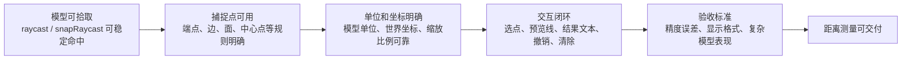

测量前置条件：

- 模型拾取稳定：`raycast()` 或 `snapRaycast()` 能在真实模型中稳定命中构件。
- 捕捉规则明确：先确认是否只做点到点，还是要支持端点、边、面、中心点、垂足等捕捉类型。
- 模型单位可靠：需要确认 IFC / `.frag` 的单位、坐标、缩放比例，否则测量值可能显示正确但业务不可信。
- 交互状态完整：需要支持选点、鼠标移动预览、测量线、测量文本、撤销、清除、退出测量模式。
- UI 展示明确：需要确认单位显示为 m、mm 还是 cm，小数位保留几位。
- 性能可接受：大模型下连续 raycast / snapRaycast 不能明显卡顿。
- 验收样本可用：需要至少 1-2 个真实模型验证测量结果和用户操作体验。

测量可行性评估：

- 点到点距离测量：可行性高，建议作为首个版本。
- 基于捕捉点的精确测量：可行性中高，取决于 `snapRaycast()` 在真实模型中的表现和捕捉类型覆盖度。
- 面积测量、角度测量：可行性中，需要额外定义测量平面、选点规则和结果展示。
- 构件级自动算量：可行性中低到中，依赖几何数据、构件分类、模型质量和业务算法，不建议放入首期测量范围。

### 6.2 主要需求前置条件总览

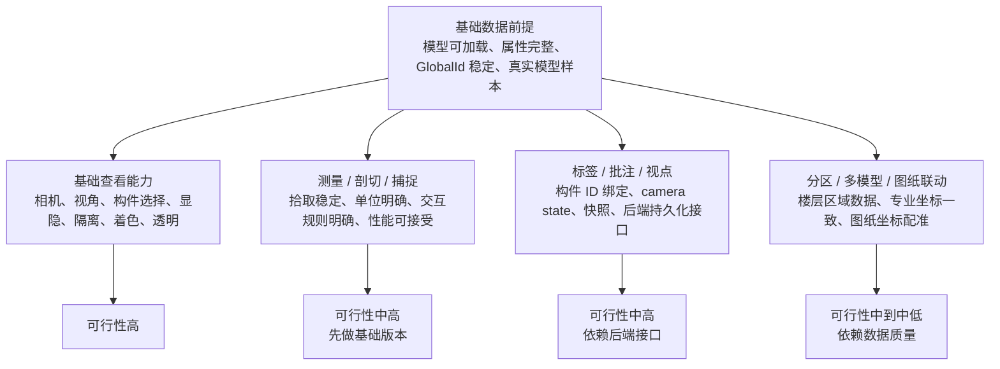

按功能类型看：

- 相机、视角、全屏、快照、构件显隐/隔离/定位/着色/透明：前置条件主要是当前 MVP 交互稳定，可行性高。
- 捕捉、测量、剖切：前置条件是拾取稳定、单位明确、交互规则明确、大模型性能可接受；基础版本可行性中高。
- 视点、标签、批注：前置条件是 `GlobalId/localId` 绑定策略、camera state 数据结构、快照保存、后端接口；可行性中高。
- 分区可视化：前置条件是楼层、区域或专业数据可用；如果 IFC 属性缺失，需要后端或业务侧补映射关系，可行性中高但依赖数据。
- 多模型管理和模型装配：前置条件是多专业模型坐标体系清楚，必要时保存 transform matrix；可行性中高。
- 路径漫游、自定义关键帧、双视窗、标签聚合：前置条件是基础视点、相机状态、标签数据和性能基线稳定；可行性中到中高，建议后置。
- 同源图纸模型联动：前置条件是 2D 图纸来源、比例尺、坐标体系、楼层关系和 3D 模型坐标配准明确；可行性中低，建议专项预研。

### 6.3 前置验证任务

建议在正式开发 P1/P2 功能前，先完成以下验证：

- T003 属性完整度验证：确认属性面板、搜索、过滤、标签、批注、分区可视化能依赖哪些字段。
- T004 ID 稳定性验证：确认 `GlobalId` 是否可作为业务主键，`localId` 是否只作为运行时 ID。
- T005 框选、拾取、捕捉性能验证：确认大模型下 raycast / snapRaycast / rectangleRaycast 的准确性和耗时。
- 单位和坐标验证：确认模型单位、缩放比例、世界坐标和多模型坐标一致性。
- 后端持久化接口验证：确认视点、标签、快照、批注、模型版本是否有稳定接口。
- 真实模型验收验证：至少使用 2-3 个真实项目模型做加载、属性、拾取、测量、性能验证。

## 7. 成熟生态复用建议

结论：可以复用成熟生态，不建议所有功能从零开发。Three.js 官方 addons 和周边库可以承担相机控制、模型变换、标签渲染、动画、后处理、性能监控、空间查询等底层能力；但 BIM 业务语义、构件 ID 绑定、模型版本、批注、视点、权限和后端持久化仍需要项目侧封装。

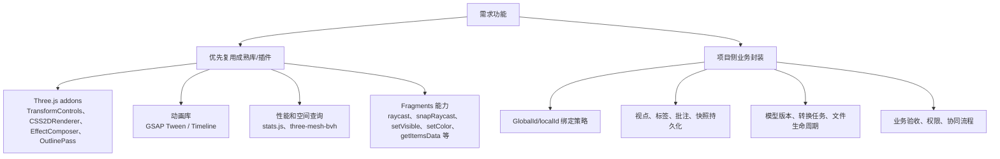

建议复用方向：

- 模型平移 / 旋转：优先使用 Three.js `TransformControls`，再封装模型 transform 保存和恢复。
- 三维标签 / 引线标签：优先使用 `CSS2DRenderer` / `CSS3DRenderer`，业务侧只处理标签数据、点击事件和构件绑定。
- 路径漫游 / 自定义关键帧：可用 GSAP 的 Tween / Timeline 做相机动画，路径编辑、关键帧数据结构和播放控制仍需自研。
- 轮廓线 / 高亮效果：可评估 Three.js `EffectComposer`、`OutlinePass`，但大模型下要做性能验证。
- 性能监控：可用 `stats.js` 快速接入 FPS、单帧耗时、内存面板。
- 大模型拾取 / 空间查询：如需对自定义 Three.js Mesh 做高频 raycast 或空间查询，可评估 `three-mesh-bvh`；如果走 Fragments 内部能力，应优先使用 Fragments 已提供的 `raycast()`、`snapRaycast()`。
- 调试面板：可用 `lil-gui` 或类似轻量 GUI 工具管理调试开关，例如剖切面、性能面板、透明度、渲染参数等。

仍需自研的部分：构件业务主键、批注/标签/视点/快照数据结构、后端持久化、模型转换链路、权限协同、图纸模型联动坐标配准。

参考来源：[Three.js 官方文档](https://threejs.org/docs/) 中包含 `TransformControls`、`EffectComposer`、`CSS2DRenderer` 等 addons；[three-mesh-bvh](https://github.com/gkjohnson/three-mesh-bvh) 用于加速 three.js mesh 的 raycasting 和空间查询；[stats.js](https://github.com/mrdoob/stats.js/) 用于 FPS、MS、内存等性能监控；[GSAP 官方文档](https://gsap.com/docs/v3/) 提供 Tween、Timeline、Keyframes 等动画能力。

## 8. 功能优先级建议

建议按“先稳定、再补基础、再业务化、最后做复杂增强”的顺序推进。

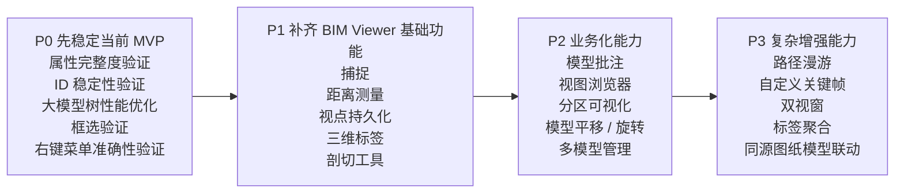

优先级依据：

- P0 先解决属性、ID、性能和关键交互稳定性，否则后续批注、搜索、标签和视点绑定都缺少可靠基础。
- P1 补齐 BIM Viewer 高频基础能力，优先服务查看、测量、标注和剖切。
- P2 进入项目级业务场景，重点是批注、视图管理、分区展示和多模型管理。
- P3 属于复杂增强，演示价值高，但成本、交互复杂度和数据依赖都更高，建议后置。

## 9. 工作量、人力与周期评估

### 9.1 估算口径

以下为当前 MVP 基础上，在 `1 名前端 + 1 名后端 + AI 协作` 条件下的粗略评估，用于评审和排期参考。AI 可明显压缩代码编写、接口样板、数据结构设计、文档整理和问题定位时间，但真实模型验证、接口联调、业务确认、BIM 数据质量问题和验收周期不能等比例压缩。

默认前提：

- 已继续采用 `Three.js + @thatopen/fragments` 作为前端主线架构。
- 已有 IFC 转 `.frag` 的基础转换链路。
- 已实现能力可继续复用：相机、选择、高亮、显隐、着色、透明、快照、模型树、属性面板等。
- 不包含完整协同平台、权限体系、复杂审批、移动端适配和大规模云端渲染。
- 当前投入为 1 名前端 + 1 名后端，并使用 AI 辅助开发、排查、重构和文档整理。
- 测试、产品确认、BIM 数据校验由前后端兼顾，业务侧按节点验收。
- 建议小步迭代：先交付可演示版本，再补稳定性和边界处理。

因此，下表时间具备排期参考性，但更适合作为“AI 协作下的乐观到中性估算”，不建议作为固定承诺工期。

### 9.2 分阶段工作量评估

按 `1 名前端 + 1 名后端 + AI 协作` 估算，阶段关系如下：

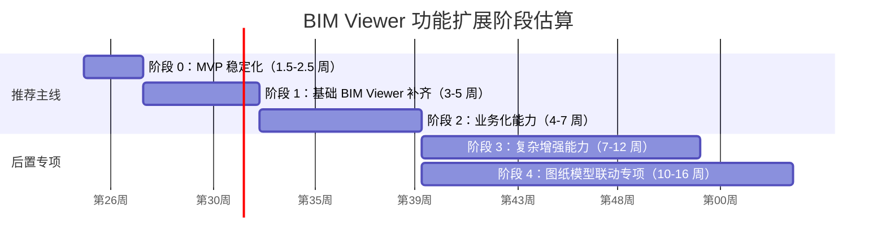

阶段说明：

- 阶段 0：T003 属性完整度验证、T004 ID 稳定性验证、大模型树性能优化、框选准确性验证、右键菜单稳定性验证。AI 可加速排查、脚本和优化实现；真实模型验证仍需人工确认。
- 阶段 1：捕捉、距离测量、视点持久化、三维标签、基础剖切工具。前端工作量较重，测量和剖切体验需要反复验证。
- 阶段 2：模型批注、视图浏览器、分区可视化、模型平移/旋转、多模型管理基础版。AI 可加速 CRUD、状态管理和接口联调；业务规则仍需确认。
- 阶段 3：路径漫游、自定义关键帧、双视窗、标签聚合、模型版本对比基础能力。复杂交互和性能调优不能完全依赖 AI，不建议与 P0-P2 并行。
- 阶段 4：同源图纸模型联动、图纸坐标映射、楼层/轴网/构件关系校验。成败主要取决于图纸/模型数据质量和 BIM 专业校验。

### 9.3 推荐首期投入

若目标是形成可演示、可试点的 BIM Viewer 增强版，首期建议只覆盖阶段 0 和阶段 1 核心功能，不同时启动 P2/P3。

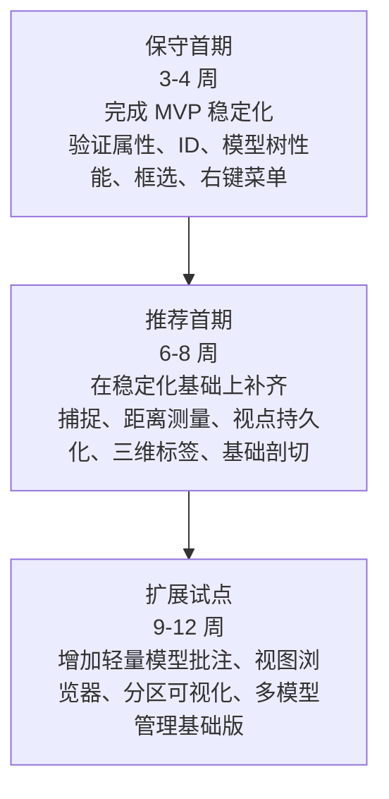

建议节奏：第 1 阶段用 1.5-2.5 周完成 MVP 稳定化和真实模型验证；第 2 阶段用 3-5 周补齐捕捉、测量、视点、标签、基础剖切；第 3 阶段根据试点反馈，从批注、视图浏览器、分区可视化、多模型管理中选择 1-2 项继续推进。

不建议首期纳入：同源图纸模型联动、复杂关键帧、双视窗、标签聚合、模型版本对比、完整权限协同、复杂审批流程。

### 9.4 当前前后端任务拆分

当前建议先围绕 MVP 稳定化和基础 BIM Viewer 能力分工，不进入复杂协同、审批流或图纸联动。

#### 前端当前要做的事

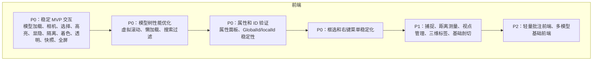

#### 后端当前要做的事

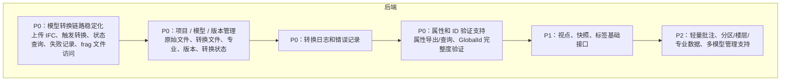

#### 当前协作边界

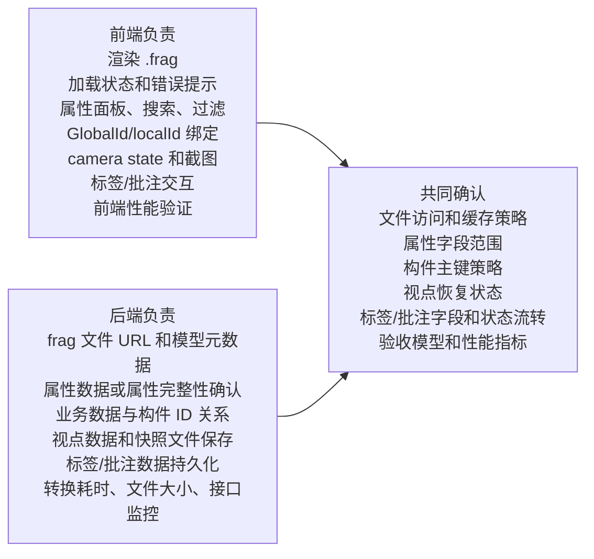

### 9.5 待确定问题

详细设计和排期前需确认：

**数据与模型**

- 实际生产模型的大小、构件数量、楼层数量、专业数量是多少；影响加载性能、模型树策略、框选性能和内存控制。
- IFC 转换后的属性是否完整，是否包含名称、编码、楼层、专业、材质等字段；影响属性面板、搜索、过滤、标签、批注和分区可视化。
- `GlobalId` 在不同版本、不同转换批次中是否稳定；影响批注、视点、问题清单、版本对比等业务数据绑定。
- 多专业模型是否共享同一坐标系，是否需要人工平移/旋转校准；影响多模型管理和模型装配。

**后端与部署**

- 是否已有项目、模型版本、视点、标签、批注、快照等接口；影响业务化功能周期。
- IFC 转 `.frag` 是前端临时转换、Node 服务转换，还是后端统一转换服务；影响部署架构、队列、日志、失败重试和并发能力。
- 目标浏览器、内网/公网部署、模型文件存储方式和静态资源访问策略是什么；影响兼容性、资源加载和安全策略。

**产品与验收**

- 截图需求中的功能是必须完全复刻，还是只需满足同类业务能力；影响前端工作量和验收边界。
- 测量、捕捉、剖切的精度要求和验收标准是什么；影响算法选择和测试用例。
- 批注、标签、快照是否需要多人协同、权限控制、历史记录和状态流转；影响后端模型和业务复杂度。
- 是否能提供 2-3 个真实项目模型作为性能和功能验收样本；影响评估准确性和上线风险。
- 2D 图纸来源、格式、坐标体系、比例尺和楼层关系是否明确；影响同源图纸模型联动是否可做以及成本。

### 9.6 主要风险与缓解建议

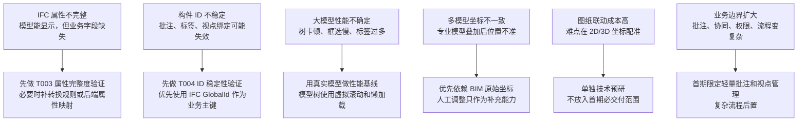

## 10. 需求之外的补充扩展能力

### 10.1 架构能力边界

本部分只列第一部分需求清单之外的补充能力。需求中已经提到或首期明确要实现的能力不再重复列出，例如相机、视角、右键菜单、测量、剖切、标签、批注、快照、构件显隐/隔离/定位/着色/透明、模型平移/旋转等。

当前架构仍适合扩展：模型数据管理、属性索引、材质信息、几何分析、版本对比、转换服务、性能监控、调试工具、模型文件生命周期和项目级数据治理。

当前架构不适合直接做：RVT 原生解析、Revit 级参数化建模、完整 BIM 编辑器、CAD 级几何建模、复杂族编辑、高精度图纸模型自动配准。

### 10.2 需求外补充能力清单

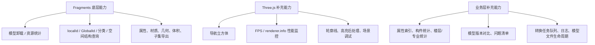

建议优先级：

- P0：T003 属性完整度验证、T004 ID 稳定性验证。
- P1：属性索引和构件统计、转换任务队列和日志、模型文件生命周期管理。
- P2：材质和几何数据分析、导航立方体和性能监控。
- P3：模型版本对比，依赖 `GlobalId` 稳定性和版本管理体系。


