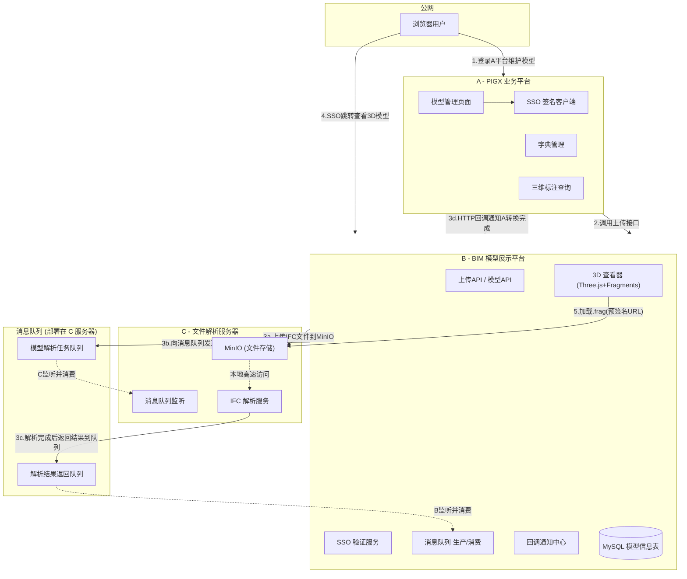
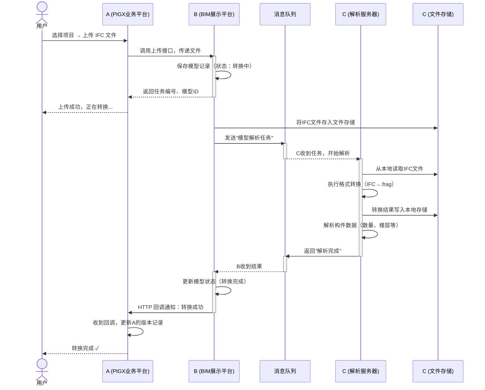
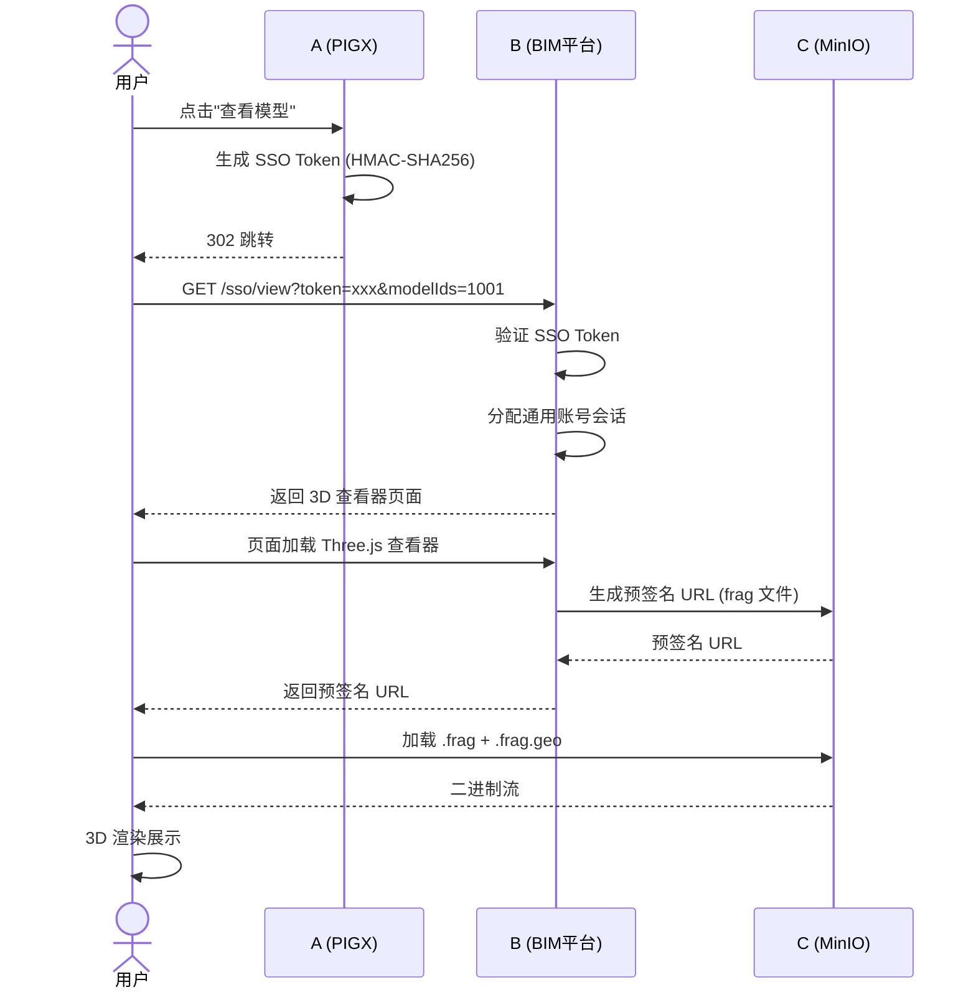
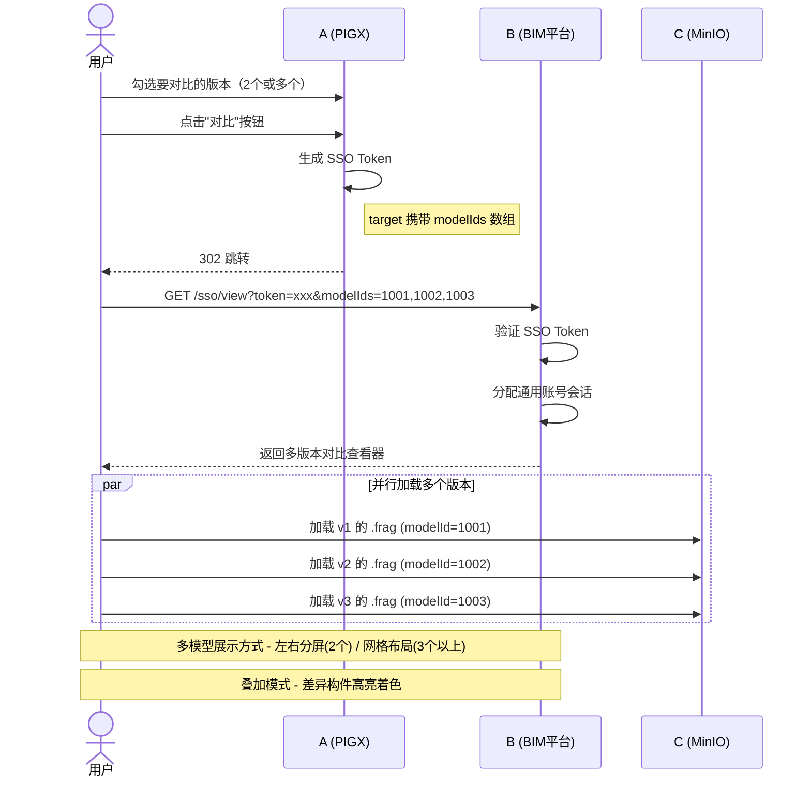
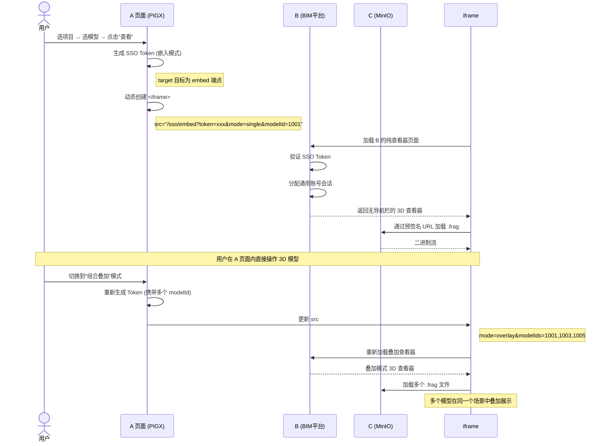
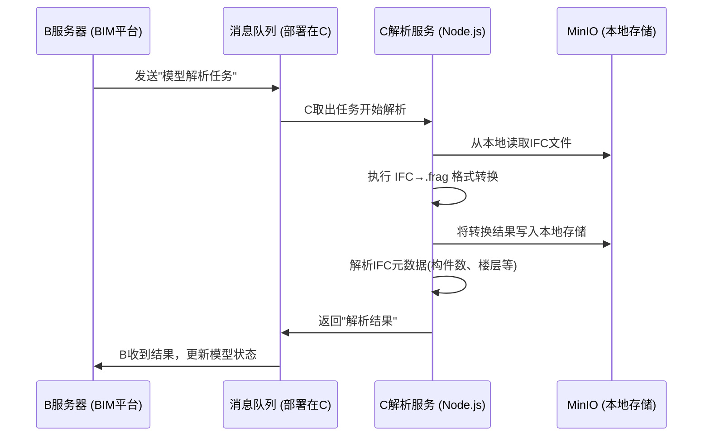
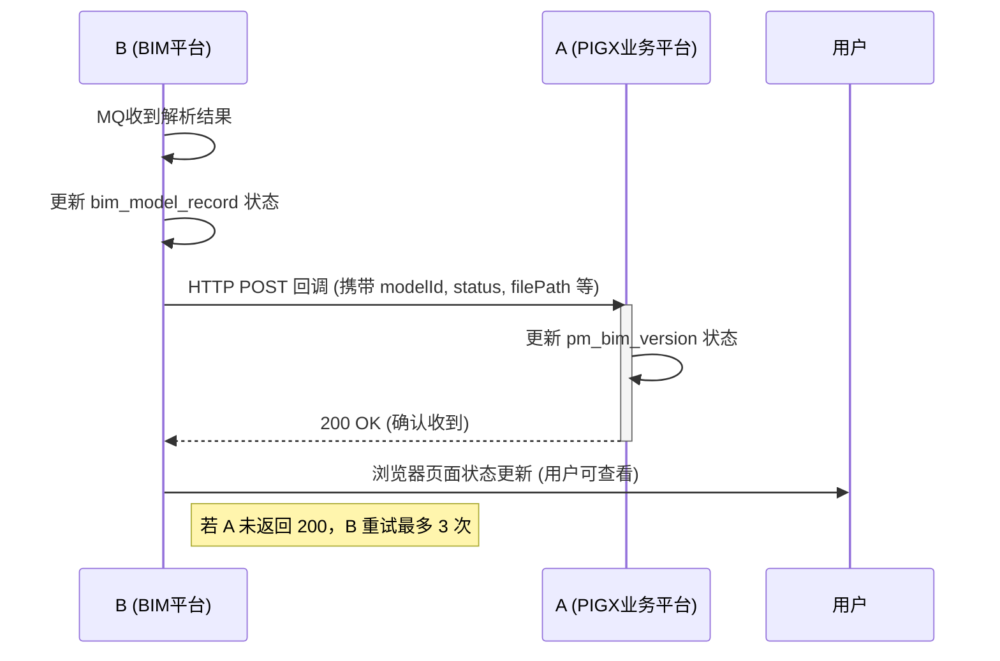
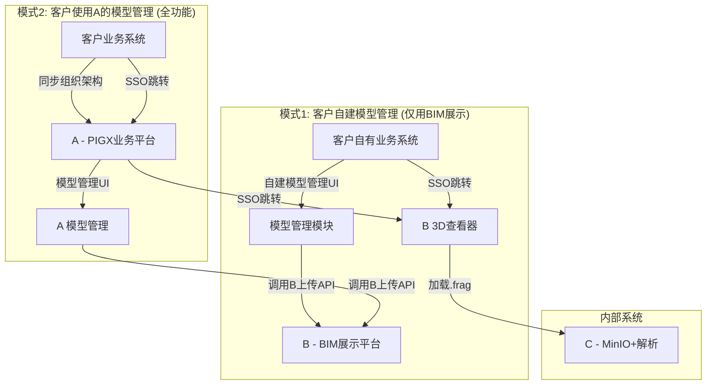
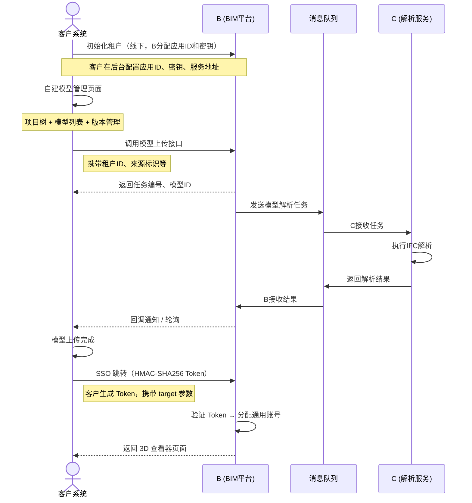
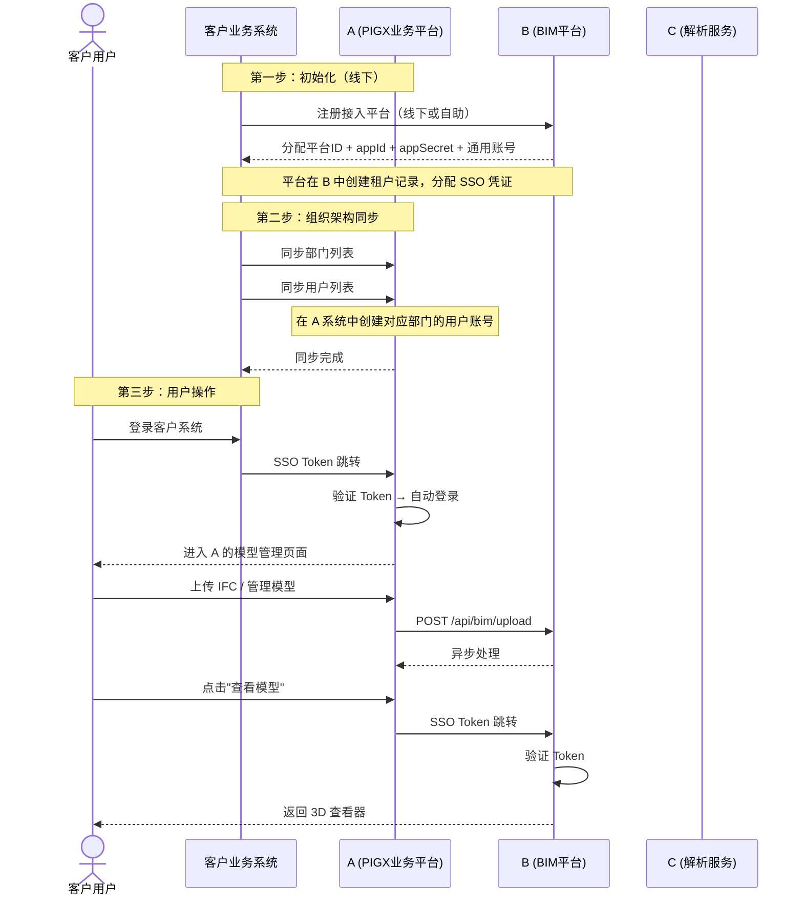

# BIM 三服务器系统架构方案

更新时间：2026-07-16

文档状态：目标部署架构，尚未表示 A/B/C 三服务器全部实施完成。

## 0. 当前 Viewer 进度修订

本文早期章节中如出现“三维查看器功能规划中”“剖切/测量/标签需求待明确”等表述，应按当前项目进度修订理解：

- 当前 `E:\BimModelThree` 已完成 Viewer MVP 前端基础版。
- 主 Viewer：`viewer-service/viewer/index.html`。
- 功能演示页：`viewer-service/viewer/demo.html`，采用左侧需求列表、右侧独立功能页面的结构。
- 当前主模型链路：`IFC -> .frag -> manifest.json -> Three.js + @thatopen/fragments Viewer`。
- 已具备基础能力：Manifest 加载、模型树、属性查看、构件选择/高亮/定位、显隐、隔离、着色、透明、框选、右键菜单、快照、视点本地持久化。
- 已具备 BIM 工具基础版：捕捉、点到点距离测量、三维标签、模型批注、基础剖切。
- 仍未完成产品化能力：标签/批注/视点后端持久化、多模型管理、模型平移/旋转、路径漫游、关键帧、双视窗、标签聚合、图纸模型联动；视图缩略图、引线标签、分区可视化已完成前端基础版，仍需后端化、字段可靠性和性能验收。

因此，本文件中与 Viewer 当前实现状态相关的历史规划内容，以 `docs/BIM模型系统MVP现状与开发记录.md` 和 `docs/BIM模型项目进度评估与进度计划表.md` 为准；本文只作为目标部署架构，不代表三服务器已完成实施。

> 基于 Three.js + @bldrs-ai/fragments 技术栈，采用三服务器解耦架构
> A(PIGX业务平台) → B(BIM模型展示平台) → C(MinIO文件服务器+IFC解析)

---

## 一、系统架构总览

### 1.1 三服务器职责

| 服务器 | 代号 | 定位 | 核心职责 |
|--------|------|------|---------|
| **PIGX 业务平台** | A | 业务门户入口 | 项目管理、模型管理UI、版本管理、字典管理、三维标注查询 |
| **BIM 模型展示平台** | B | BIM 数据中枢 | 模型信息存储、上传API、MQ调度、SSO验证、3D查看器、回调通知 |
| **文件解析服务器** | C | 存储+计算 | MinIO 对象存储、IFC→.frag 解析转换 |

### 1.2 核心原则

1. **用户不直接访问 B**：所有用户通过 A 登录，通过 SSO 跳转进入 B 的 3D 查看器
2. **上传接口只暴露在 B**：A 调用 B 的上传 API，B 统一管理模型文件流转
3. **C 服务器对内不对外**：MinIO 和解析服务只对内网暴露，不提供公网接口
4. **消息队列保障异步可靠**：B 与 C 之间通过消息队列解耦，确保转换任务不丢失

### 1.3 技术栈

| 组件 | A 服务器 (PIGX) | B 服务器 (BIM平台) | C 服务器 (文件服务器) |
|------|----------------|-------------------|-------------------|
| **后端语言** | Java (Spring Cloud) | Java (Spring Boot) | Node.js |
| **数据库** | MySQL (业务数据) | MySQL (模型信息) | 无（仅文件） |
| **存储** | 无 | 无 | MinIO (S3) |
| **消息队列** | 无（接收回调通知） | RabbitMQ (生产者+消费者) | RabbitMQ (消费者+生产者) |
| **3D渲染** | 无 | Three.js + Fragments 查看器 | 无 |
| **转换工具** | 无 | 无 | fragments-cli (Node.js) |
| **SSO** | HMAC-SHA256 签名端 | HMAC-SHA256 验证端 | 无 |

---

### 1.4 整体架构图



---

## 二、核心交互流程

### 2.1 模型上传流程（完整时序）



### 2.2 模型查看流程（SSO 跳转）



### 2.3 多版本对比流程

支持 **2 个或多个版本** 同时对比，用户可在 A 的模型管理页面勾选需要对比的版本，点击对比按钮后 SSO 跳转到 B 的对比查看器。

**操作入口**：

```
在 A 的版本管理列表中：
  ☐ v1  ← 勾选
  ☑ v2  ← 勾选
  ☑ v3  ← 勾选
  [☑已选3个版本 → 对比]  ← 点击按钮跳转
```



**多版本对比展示方案**：

| 版本数 | 推荐布局 | 说明 |
|--------|---------|------|
| 2 个 | 左右分屏 | 左侧旧版本，右侧新版本，差异构件着色 |
| 3 个 | 左中右三屏 | 依次排列，可选任意两个做差异高亮 |


**差异着色规则**：

```
叠加模式下，以选中"基准版本"为参照：
  基准版本所有构件 → 灰色(半透明)
  其他版本不同的构件 → 按版本分配颜色
    版本A特有:  红色
    版本B特有:  蓝色  
    版本C特有:  绿色
  三版本共有 → 灰色实心
```

### 2.4 SSO 认证流程

A 平台的用户跳转到 B 平台时，通过 **安全签名** 实现单点登录。

```
步骤：

1. A 生成安全令牌:
   - 参数：appId（A分配的应用ID）、timestamp（当前时间）、目标路径
   - 使用 HMAC-SHA256 加密签名（用双方约定的密钥 appSecret 进行加密）
   - 生成一次性令牌，有效期 5 分钟

2. 用户跳转 B:
   - 浏览器 302 重定向到 B，URL 中携带令牌和目标页面
   - 示例跳转参数：?token=xxxx&target=/view?modelIds=1001

3. B 验证令牌:
   - 根据 appId 找到对应的密钥
   - 重新计算签名进行比对，校验通过后进入系统
   - 确保令牌在有效期内且未被重复使用

4. 通用账号分配（核心：B 不感知接入平台的具体用户）:

   原理说明：
   A 服务整体作为一个**接入平台**，在 B 中对应一个租户、一个通用账号。
   A 内部可以有自己的用户体系和租户体系，但 B 不关心这些，
   A 的所有用户共享 B 的一个通用账号。

   ┌─────────────────────────────────────────────────┐
   │ A 平台（一个接入平台）                           │
   │   ├─ 租户 tenant_001                            │
   │   │    ├─ 用户 A1（项目经理）                     │
   │   │    ├─ 用户 A2（技术员）    ──→  B 通用账号    │
   │   │    └─ 用户 A3（质检员）        bim_guest_a   │
   │   ├─ 租户 tenant_002            （共享使用）      │
   │   │    ├─ 用户 B1                                │
   │   │    └─ 用户 B2                                │
   └─────────────────────────────────────────────────┘

   好处：
   - 无需在 B 平台为每个 A 用户逐一创建账号
   - 无需在 A 和 B 之间同步用户列表和组织架构
   - 某个 A 用户离职/新增，不影响 B 平台的访问
   - 新平台接入时，B 只需创建一个租户 + 分配一个通用账号

   详细流程：
   a. 平台接入时，B 为该平台创建一个租户（如 platform_a），
      分配一个固定通用账号（如 bim_guest_a），并生成 appId + appSecret。
      appId + appSecret 即回调配置功能中分配给该平台的凭证。
   b. A 用户登录 A 平台后，点击"查看模型"，A 生成 SSO Token。
   c. 用户携带 Token 跳转到 B，B 验证 Token 通过后，
      从 Token 中提取 appId 找到对应平台和通用账号。
   d. B 自动为该通用账号创建会话（Session/Cookie），返回 3D 查看器页面。
   e. 此后该用户的浏览器与 B 的交互（如模型旋转、点击构件）
      都以这个通用账号的身份进行，直到会话过期。

   权限范围：
   通用账号只有**只读权限**：
   - 查看已授权给自己的模型
   - 查看模型上的标注
   - 执行旋转/缩放/点击等 3D 交互操作
   通用账号**没有**以下权限：
   - 上传/删除模型
   - 删除/修改标注
   - 管理字典
   - 管理版本

   数据隔离：
   B 服务器通过 `tenant_id` 确保不同接入平台的数据完全隔离。
   bim_guest_a 只能看到 platform_a 的模型，看不到其他平台的模型。
   即便 Token 泄露，攻击者也最多访问该平台的数据。

   会话有效期：
   - SSO Token 本身只有 5 分钟有效期（防止重放攻击）
   - B 的通用账号会话有效期一般为 30 分钟无操作后自动过期
   - 用户关闭浏览器标签页后，会话立即失效
```

### 2.5 iframe 内嵌查看流程

A 通过 iframe 将 B 的 3D 查看器嵌入到 A 的页面中，用户在 A 的页面内直接操作模型，无需离开当前页面。



---

## 三、三台服务器详解

### 3.1 A 服务器 - PIGX 业务平台

#### 3.1.1 功能总览

A 服务器是业务门户入口，提供模型管理相关的**UI 和管理功能**，不直接处理文件存储和转换。

| 功能模块 | 说明 | 
|---------|------|
| **项目管理** | 左侧项目树，项目下挂载多个楼栋/模型 |
| **模型管理** | 右侧上方模型列表，每个模型展示基本信息 |
| **版本管理** | 右侧下方版本列表，支持上传新版本、多版本勾选对比 |
| **字典管理** | 三维标识分类字典，字典项可存储 BIM 图片 |
| **三维标注查询** | 按模型/版本/分类查询标注列表 |
| **SSO 跳转** | 点击"查看模型"生成 SSO Token 跳转到 B |
| **项目模型查看** | 在 A 页面内嵌入 B 的 3D 查看器，支持单模型查看、多版本对比、多模型叠加 |
| **视角管理** | 保存/恢复模型的 3D 视角状态（相机角度、选中/隐藏/着色构件） |
| **漫游路线管理** | 创建/播放/分享模型的 3D 漫游路线，支持路径点和视角自动切换 |
| **三维查看器功能** | 构件选择、属性查看、测量、剖切、标签、批注等已具备前端基础版；后端持久化和协同能力后续补齐，详见 3.1.8 |

#### 3.1.2 模型管理页面布局

```
┌─────────────────────────────────────────────────────────────┐
│  [项目管理]                                                 │
│  ┌──────────────┐  ┌──────────────────────────────────────┐ │
│  │ 项目A         │  │  模型数据（上）                        │ │
│  │  ├─ 1号楼     │  │  ┌─────┬──────┬──────┬──────┬──────┐│ │
│  │  ├─ 2号楼     │  │  │名称 │编号  │类型  │版本  │操作  ││ │
│  │  ├─ 3号楼     │  │  ├─────┼──────┼──────┼──────┼──────┤│ │
│  │  │            │  │  │1号楼│B001  │建筑  │v3   │查看📌││ │
│  │ 项目B         │  │  │2号楼│B002  │结构  │v2   │查看📌││ │
│  │  ├─ 5号楼     │  │  └─────┴──────┴──────┴──────┴──────┘│ │
│  │  │            │  │                                       │ │
│  │              │  │  版本管理（下）                          │ │
│  │              │  │  ┌──┬─────┬──────┬──────┬──────────┐  │ │
│  │              │  │  │☑│版本 │时间  │状态  │操作      │  │ │
│  │              │  │  ├──┼─────┼──────┼──────┼──────────┤  │ │
│  │              │  │  │☑│v3  │06-20 │✅完成│下载      │  │ │
│  │              │  │  │☐│v2  │06-10 │✅完成│下载      │  │ │
│  │              │  │  │☐│v1  │05-28 │✅完成│下载      │  │ │
│  │              │  │  └──┴─────┴──────┴──────┴──────────┘  │ │
│  │              │  │  [上传新版本]  [☑已选2个版本 → 对比]    │ │
│  └──────────────┘  └──────────────────────────────────────┘ │
└─────────────────────────────────────────────────────────────┘
```

#### 3.1.3 字典管理

**字典类型：三维标识分类**

| 字典编码 | 字典项名称 | 存储内容 |
|---------|-----------|---------|
| `annotation_category` | 质量缺陷 | BIM 图片路径 |
| `annotation_category` | 安全隐患 | BIM 图片路径 |
| `annotation_category` | 设备标记 | BIM 图片路径 |
| `annotation_category` | 进度标记 | BIM 图片路径 |

字典项中存储的是 **BIM 标记图片 URL**（图片存储在 A 服务器自身的业务 MinIO 上），用户在 B 的 3D 查看器中做标注时，选择分类字典，模型上对应展示该分类的图片标记。

#### 3.1.4 三维标注查询

A 服务器提供按条件查询标注列表功能：

- **筛选维度**：项目、模型、版本、标注分类、标注时间
- **展示字段**：标注ID、构件ID、标注分类、标注内容、3D坐标、创建人、创建时间
- **操作**：点击标注 → SSO 跳转到 B 的 3D 查看器并定位到该标注位置

#### 3.1.5 视角管理

视角管理用于**保存和恢复模型的 3D 视角状态**，用户在 B 的 3D 查看器中调整好相机角度、选中/隐藏/着色特定构件后，可以将当前视角保存下来，下次快速恢复。

**核心字段**：

| 字段 | 说明 |
|------|------|
| `id` | 主键 |
| `tenant_id` | 租户ID |
| `model_record_id` | 关联的模型记录ID |
| `view_name` | 视角名称（如：东北视角、首层结构） |
| `view_type` | 视角类型：iso（等轴测）/ top（俯视）/ front（正视）/ 预置视角或 custom（自定义） |
| `camera_state_json` | 相机状态 JSON，包含 position（位置）、quaternion（朝向）、target（目标点）、near/far（近远裁剪面）、zoom（缩放） |
| `selected_ids_json` | 选中构件的 localId 集合，用于恢复时高亮这些构件 |
| `hidden_ids_json` | 隐藏构件的 localId 集合，恢复时保持隐藏状态 |
| `colored_ids_json` | 着色构件的 localId 集合，恢复时保持颜色标记 |
| `snapshot_url` | 视角缩略图/快照地址 |
| `description` | 备注 |
| `sort_no` | 排序号 |

**使用流程**：

1. 用户在 B 的 3D 查看器中调整到目标视角（旋转、缩放、选中/隐藏/着色构件）
2. 点击"保存视角"，输入视角名称，B 将当前相机状态和构件状态保存到 A 的 `bim_viewpoint` 表
3. 下次用户打开该模型时，在查看器中可以快速切换到已保存的视角
4. 视角列表按 `sort_no` 排序，支持多人共享（由 A 的用户权限控制）

#### 3.1.6 项目模型查看

在 A 的模型管理页面中新增 **项目模型查看** 功能，用户无需跳转到 B 的独立页面，直接在 A 的页面内通过 iframe 嵌入 B 的 3D 查看器查看模型。

**页面布局**：

```
┌─────────────────────────────────────────────────────────────┐
│                                                             │
│ ┌─── 操作栏 ───────────────────────────────────────────────┐ │
│ │ 项目: [下拉选择 ▼]  模型: [下拉选择 ▼]  版本: [下拉选择 ▼]│     │
│ │ [查看]  [对比]  [组合叠加]                               │   │
│ └──────────────────────────────────────────────────────────┘│
│                                                             │
│ ┌─── 3D 查看器（内嵌 B 服务器页面） ──────────────────────┐     │
│ │                                                     │     │
│ │            BIM 模型 3D 展示区域                       │     │
│ │            （iframe 嵌入 B 的查看器页面）              │     │
│ │                                                     │     │
│ └─────────────────────────────────────────────────────┘     │
└─────────────────────────────────────────────────────────────┘
```

**操作说明**：

| 操作 | 说明 |
|------|------|
| **选项目** | 下拉选择项目，选完后模型下拉自动加载该项目下的所有模型 |
| **选模型** | 下拉选择要查看的模型，默认选中最新版本 |
| **选版本** | 可选：不选则默认加载最新版本；也可手动选择特定历史版本 |
| **查看** | 点击后 iframe 加载 B 的 3D 查看器，显示选中模型的 .frag |
| **对比** | 选择 2 个或多个版本，iframe 加载对比视图（左右分屏/网格） |
| **组合叠加** | 选择多个模型（不同楼栋或不同专业），在同一个 3D 场景中叠加展示 |

**技术实现**：

A 通过 iframe 嵌入 B 的查看器页面时，仍然走 **SSO 认证**流程，但目标不是 302 跳转，而是在 iframe src 中直接附带 SSO Token：

```
<iframe src="https://b-server/sso/embed?token=xxx&mode=single&modelId=1001" />
<iframe src="https://b-server/sso/embed?token=xxx&mode=diff&modelIds=1001,1002" />
<iframe src="https://b-server/sso/embed?token=xxx&mode=overlay&modelIds=1001,1003,1005" />
```

B 提供专门的 `/sso/embed` 端点，验证 Token 后返回一个**无导航栏、无边框**的纯净 3D 查看器页面（仅包含 Three.js 渲染区域），专为 iframe 嵌入场景优化。

**与 SSO 跳转对比**：

| 维度 | SSO 跳转查看（原方案） | iframe 内嵌查看（新增） |
|------|---------------------|---------------------|
| 用户体验 | 跳转到 B 独立页面，浏览器全屏 | 在 A 页面内直接查看，无需离开 |
| 实现复杂度 | 简单，标准 SSO 跳转 | 需 B 提供纯查看器 embed 端点 |
| 适用场景 | 专注查看模型，有独立查看需求 | 日常快速浏览，回到业务操作方便 |
| 多模型组合 | 仅支持版本对比 | 支持任意模型叠加（不同楼栋/专业） |
| 导航栏 | B 标准页面（含 B 的导航） | 无导航栏，仅 3D 渲染区域 |

#### 3.1.7 漫游路线管理

漫游路线管理用于**创建和播放模型的 3D 漫游路线**，用户可以在 B 的 3D 查看器中设定一系列路径点，每个路径点记录相机位置和朝向，B 按顺序自动切换视角，形成漫游动画效果。

包含两张表：`bim_roam_route`（路线主表）和 `bim_roam_route_point`（路径点明细表）。

**bim_roam_route（漫游路线主表）**

| 字段 | 说明 |
|------|------|
| `id` | 主键 |
| `tenant_id` | 租户ID |
| `model_record_id` | 关联的模型记录ID |
| `route_name` | 路线名称（如：首层巡检路线） |
| `route_desc` | 路线说明 |
| `status` | 状态：draft（草稿）/ published（已发布）/ disabled（禁用） |
| `loop_enabled` | 是否循环播放 |
| `default_speed` | 默认播放速度 |
| `total_duration` | 总时长（秒） |
| `snapshot_url` | 路线封面图 |

**bim_roam_route_point（漫游路径点表）**

| 字段 | 说明 |
|------|------|
| `id` | 主键 |
| `route_id` | 关联的路线ID |
| `seq_no` | 路径点顺序号 |
| `point_name` | 路径点名称 |
| `camera_state_json` | 该点的相机状态 JSON（position、target 等） |
| `duration_seconds` | 到达该点的耗时/停留时长（秒） |
| `hold_seconds` | 到达后停留时长（秒），0 表示不停留直接到下一个点 |
| `easing_type` | 插值方式：linear（线性）/ easeIn（缓入）/ easeOut（缓出）/ easeInOut（缓入缓出） |
| `focus_ids_json` | 当前聚焦构件的 localId 集合，到达该点时高亮这些构件 |
| `snapshot_url` | 路径点快照 |

**使用流程**：

1. 用户在 B 的 3D 查看器中调整到目标视角，点击"添加路径点"，保存当前相机状态
2. 重复操作添加多个路径点，按需调整顺序、停留时长和过渡效果
3. 保存路线，B 将路线数据和路径点数据分别存入 `bim_roam_route` 和 `bim_roam_route_point`
4. 播放时 B 按 `seq_no` 顺序依次切换视角，支持线性或缓动插值
5. 用户可分享路线给其他项目成员查看

#### 3.1.8 三维查看器功能（规划中）

以下三维查看器相关功能已纳入规划，但目前**需求尚不明确**，需进一步沟通调研后写入正式文档：

| 功能 | 说明 | 状态 |
|------|------|------|
| **剖切** | 对模型进行剖面切割，观察内部结构 | 已实现基础单轴剖切；多剖切/剖切盒后续增强 |
| **导航立方体** | 3D 场景中的方向指示器（ViewCube），快速切换视角方向 | 未实现；可作为视角工具增强项 |
| **测量** | 在模型上进行距离、角度、面积等测量 | 已实现点到点距离测量基础版；角度/面积后续增强 |
| **构件选择** | 点击/框选/按条件筛选模型中的构件 | 已实现点击选择和框选基础版；条件筛选后续结合模型树搜索过滤 |
| **视图样式切换** | 切换模型显示模式（线框、半透明、X 光透视等） | 已实现着色、透明、显隐、隔离基础能力；线框/X 光后续增强 |
| **截图** | 对当前 3D 视图进行截图保存 | 已实现快照基础版 |
| **透视** | 透视模式，透过遮挡查看后方构件 | 已具备透明度调整基础能力；专用透视模式后续增强 |
| **构件属性查看** | 点击构件查看其属性信息（类型、材质、尺寸等） | 已实现基础版；仍需 T003 属性完整度验证 |
| **工程量统计** | 基于模型构件自动计算工程量（混凝土量、钢筋量等） | 未实现；依赖属性、分类和算量规则 |
| **碰撞检查** | 检测模型中各构件之间的空间碰撞冲突 | 未实现；建议后置专项 |
| **BCF 视图协作** | 基于 BCF（BIM Collaboration Format）标准的视图协作分享 | 未实现；依赖后端协同和视点/批注持久化 |
| **快照** | 保存当前 3D 视图的快照，附带标注信息分享给他人 | 已实现截图基础版；附带标注和后端保存后续增强 |
| **自定义关键帧** | 自定义模型动画的关键帧，生成施工模拟或漫游动画 | 未实现；P3 后置 |
| **添加视点** | 在模型中添加视点标记，方便快速定位到指定位置 | 已实现本地视点保存/恢复基础版；后端持久化后续增强 |
| **标签管理** | 在模型构件上添加/编辑/管理文字标签 | 已实现前端基础版；后端持久化、引线和聚合后续增强 |

> **说明**：以上功能均为 B 服务器 3D 查看器的增强能力，通过 iframe 嵌入或 SSO 跳转方式提供
> 给 A 用户使用。具体实现方式、使用流程和交互细节待后续调研确认后补充。

---

### 3.2 B 服务器 - BIM 模型展示平台

#### 3.2.1 功能总览

B 服务器是 BIM 数据的核心中枢，所有模型数据的管理入口和 3D 查看器都部署在此。

| 功能模块 | 说明 |
|---------|------|
| **模型上传 API** | 接收 A 上传的 IFC 文件，编排转换流程 |
| **模型信息管理** | 模型记录（不分版本）的增删改查 |
| **3D 查看器** | 基于 Three.js + Fragments 的 BIM 查看器，支持单模型查看和多版本对比 |
| **SSO 验证** | 验证 A 跳转过来的 SSO Token |
| **模型对比 API** | 接收 A 的多版本对比请求，生成对比视图 SSO Token |
| **回调管理** | 管理所有租户的回调配置，转换完成后执行 HTTP 回调通知 A |
| **MQ 消费/生产** | 消费转换任务、生产转换结果 |

#### 3.2.2 BIM 模型信息表（核心表）

**不分版本**，每次上传（包括版本更新）都生成一条独立记录：

| 字段 | 说明 |
|------|------|
| `id` | 主键 |
| `model_code` | 模型编号 |
| `model_name` | 模型名称（如：1号楼建筑模型） |
| `model_type` | 类型：architecture/structure/mep |
| `tenant_id` | 租户ID（数据隔离） |
| `ifc_file_path` | IFC 文件在 MinIO 的路径 |
| `frag_file_path` | .frag 文件在 MinIO 的路径 |
| `status` | 0-转换中 1-转换完成 2-转换失败 |
| `file_size` | 文件大小 |
| `create_time` | 上传时间 |

> **注意**：B 的表是完全独立的扁平结构，不关联任何业务实体。每次上传一条记录。其他系统（如 A 服务器）如需关联此模型，在自己的数据库中存储 B 表的 `id` 即可。

#### 3.2.3 回调管理

B 提供**接入平台级回调地址管理**功能，每个接入平台在 B 服务中只能配置一个回调地址。当模型解析完成后，B 自动通过 HTTP 回调通知该平台更新模型状态。

**配置方式**：

平台管理员通过 B 提供的 API 注册回调地址，B 统一管理所有接入平台的配置：

```
┌─────────────────────────────────────────────────────┐
│  回调配置管理                                        │
│                                                      │
│  平台ID: platform_a       appId: a_xxxxx            │
│                                                      │
│  回调URL: [https://a-server/api/bim/callback  ]     │
│                                                      │
│  appSecret: [********************************] [生成]│
│                                                      │
│  [保存配置]  [测试回调]                               │
│                                                      │
│  ┌─── 回调记录（最近 30 条） ────────────────────────┐ │
│  │ 时间          │ 模型      │ 状态    │ 详情       │ │
│  │ 06-24 10:30  │ 1号楼 v3  │ ✅成功  │ 查看       │ │
│  │ 06-24 10:15  │ 2号楼 v2  │ ✅成功  │ 查看       │ │
│  │ 06-24 09:50  │ 3号楼 v1  │ ❌失败  │ 重试/查看  │ │
│  └────────────────────────────────────────────────────┘ │
└─────────────────────────────────────────────────────┘
```

**B 提供的 API**：

| 方法 | 路径 | 说明 |
|------|------|------|
| `POST` | `/api/platform/callback` | 新增/更新接入平台的回调配置 |
| `GET` | `/api/platform/callback` | 查询当前平台的回调配置 |
| `DELETE` | `/api/platform/callback` | 删除回调配置 |
| `POST` | `/api/platform/callback/test` | 测试回调地址是否可达 |

**回调触发流程**：

```
1. B 收到 MQ 解析结果
2. B 更新 bim_model_record 表状态
3. B 查询当前接入平台的回调配置
4. B 向回调地址发送 HTTP POST（含 modelId、versionId、status 等信息）
5. 平台系统返回 200 OK → 回调成功
6. 平台系统返回非 200 → B 重试（最多 3 次：5s → 30s → 120s）
7. 超 3 次失败 → 入库记录，B 后台可手动重推
```

**回调日志**：

B 记录每次回调的完整日志，包括请求时间、响应状态、耗时、重试次数，可在 B 的管理后台查看和检索。

---

### 3.3 C 服务器 - MinIO + 解析服务

> C 服务器是**纯基础设施**，没有数据库、没有业务表、没有增删改查接口。
> 只做两件事：文件存储 + IFC 解析。

#### 3.3.1 MinIO 存储结构

```
Bucket: bim-models/
├── ifc/{tenantId}/{modelId}/
│   └── model.ifc                    # 原始 IFC 文件
├── frag/{tenantId}/{modelId}/
│   ├── model.frag                   # Fragments 格式
│   ├── model.frag.geo               # 几何数据
│   └── model.frag.json              # 元数据
└── thumbnails/{modelId}/
    └── thumbnail.png                # 模型缩略图
```

#### 3.3.2 IFC 解析服务

C 服务器上的解析服务是一个 **Node.js 应用**，通过 RabbitMQ 接收转换任务：



**解析服务返回的数据结构**：

```json
{
  "success": true,
  "taskId": "uuid",
  "modelInfo": {
    "name": "提取的模型名称",
    "ifcSchema": "IFC2X3",
    "project": "项目名称"
  },
  "statistics": {
    "totalEntities": 1523,
    "wallsCount": 245,
    "slabsCount": 86,
    "columnsCount": 64,
    "windowsCount": 128,
    "doorsCount": 56,
    "floorCount": 6
  },
  "fragFiles": {
    "fragPath": "frag/tenant1/1001/model.frag",
    "fragGeoPath": "frag/tenant1/1001/model.frag.geo",
    "fragJsonPath": "frag/tenant1/1001/model.frag.json"
  },
  "fileSize": {
    "ifcBytes": 52428800,
    "fragBytes": 12582912,
    "fragGeoBytes": 33554432
  }
}
```

---

## 四、通信机制

### 4.1 消息队列

消息队列（RabbitMQ）是连接 B 和 C 的核心纽带，负责异步调度模型解析任务，避免 B 服务器长时间等待。

#### 4.1.1 消息流转

```
┌─────────────┐       ┌──────────────────┐       ┌──────────────┐
│  B 服务器    │ ──①──→ │   模型解析任务队列  │ ──②──→ │  C 解析服务器  │
│  (任务发起方) │       │  (等待解析的消息)  │       │  (任务执行方)  │
└─────────────┘       └──────────────────┘       └──────┬───────┘
        ↑                                                │
        │       ┌──────────────────┐                     │
        └──④─── │   解析结果返回队列  │ ←────────────────③──┘
                 │  (已完成的消息)   │
                 └──────────────────┘

  ① B 上传IFC后，发送"模型解析任务"到任务队列
  ② C 监听任务队列，取出任务执行解析
  ③ C 解析完成后，发送"解析结果"到结果队列
  ④ B 监听结果队列，收到结果后更新状态、通知A
```

#### 4.1.2 消息内容

**任务请求（B 发送给 C）**：

| 字段 | 说明 |
|------|------|
| taskId | 任务唯一编号 |
| ifcPath | IFC 文件在 MinIO 上的路径 |
| modelId | 模型记录 ID |

**结果返回（C 发送给 B）**：

| 字段 | 说明 |
|------|------|
| taskId | 任务唯一编号 |
| success | 是否成功 |
| fragPath | .frag 文件在 MinIO 上的路径 |
| statistics | 统计信息：构件数量、楼层数量等 |
| duration | 解析耗时（毫秒） |

#### 4.1.3 异常处理

| 场景 | 处理方式 |
|------|---------|
| 解析失败 | C 返回失败结果，B 将模型状态标记为失败并通知 A |
| 消息处理异常 | 消息队列自动重试（最多 3 次） |
| 超过重试次数 | 转入异常消息队列，人工介入排查 |
| B 收到结果时宕机 | 消息留在队列中，B 恢复后自动重新消费 |

### 4.2 回调通知机制

转换完成后，B 通过 **HTTP 回调** 的方式通知 A 更新模型状态，替代原来的 SSE 长连接推送。

#### 4.2.1 回调地址配置

每个接入平台在 B 服务中配置一个回调地址，一个平台仅允许配置一个地址：

```
B 服务后台 → 回调地址管理 → 新增平台回调配置

配置字段：
  - 平台ID（必填，唯一，如 platform_a）
  - 回调URL（必填，平台提供的接收通知接口地址）
  - appId（B 自动生成，用于 SSO 签名标识）
  - appSecret（B 自动生成，SSO 签名密钥 + 回调签名密钥）
  - 状态：启用/停用
```

**B 提供的 API**：

| 接口 | 方法 | 说明 |
|------|------|------|
| `POST /api/platform/callback` | 新增/更新回调配置 | 平台调用此接口配置自己的回调地址 |
| `GET /api/platform/callback` | 查看当前配置 | 查看已配置的回调地址和 appId/appSecret |
| `DELETE /api/platform/callback` | 删除配置 | 停用回调 |

#### 4.2.2 回调执行流程

B 收到 MQ 的解析结果后，执行以下操作：

```
1. B 更新自己的 bim_model_record 表状态为转换完成
2. B 查询当前租户的回调 URL 配置
3. B 向回调地址发送 HTTP POST 请求
4. A 收到回调后，更新自己的 pm_bim_version 表状态
5. A 返回 200 OK 确认收到
6. 若回调失败，B 最多重试 3 次，间隔递增（5s → 30s → 120s）
```



#### 4.2.3 回调内容

```json
{
    "modelId": 1001,
    "modelRecordId": 1001,
    "versionId": 3,
    "status": "completed",
    "fragFileUrl": "https://c-minio/bim/.../model.frag",
    "statistics": {
        "entityCount": 15234,
        "floorCount": 6,
        "fileSize": 45678900
    },
    "timestamp": "2026-06-24T10:30:00+08:00",
    "signature": "hmac-sha256-signature"
}
```

**字段说明**：

| 字段 | 说明 |
|------|------|
| `modelId` | B 的模型记录 ID（bim_model_record.id） |
| `modelRecordId` | 同 modelId，兼容不同命名习惯 |
| `versionId` | A 的版本记录 ID（对应 pm_bim_version 的主键） |
| `status` | 状态：completed（完成）/ failed（失败） |
| `fragFileUrl` | 转换后的 .frag 文件访问 URL |
| `statistics` | 构件统计信息 |
| `timestamp` | 回调发生时间 |
| `signature` | 可选签名，A 可校验回调来源的合法性 |

#### 4.2.4 失败重试策略

| 重试次数 | 等待间隔 | 说明 |
|---------|---------|------|
| 第 1 次 | 5 秒 | 立即重试 |
| 第 2 次 | 30 秒 | 可能是网络抖动 |
| 第 3 次 | 120 秒 | 间隔拉长，避免频繁请求 |
| 超过 3 次 | 写入失败日志 | 人工介入排查回调地址是否正常 |

若重试 3 次后仍失败，B 将回调用失败记录入库，可通过 B 的管理后台查看并手动重推。

---

## 五、数据设计

> **说明**：本章的数据库设计仅作为方案示意和沟通参考，用于明确表结构关系和数据归属，
> **不作为最终的建表 DDL 方案**。实际建表时可能根据开发情况进行调整（字段增减、索引优化等）。

### 5.1 数据库设计

#### 5.1.1 A 服务器表 (PIGX 业务库)

**pm_bim_project_model（项目模型关联表）**

```sql
CREATE TABLE pm_bim_project_model (
    id              BIGINT PRIMARY KEY AUTO_INCREMENT,
    project_id      BIGINT NOT NULL COMMENT '项目ID',
    project_code    VARCHAR(100) COMMENT '项目编码',
    building_name   VARCHAR(200) COMMENT '楼栋名称(如: 1号楼)',
    model_code      VARCHAR(100) COMMENT '模型编号',
    model_type      VARCHAR(50) COMMENT '模型类型',
    external_biz_id VARCHAR(100) COMMENT 'B服务器模型记录ID',
    current_version INT DEFAULT 1 COMMENT '当前版本号',
    create_time     DATETIME,
    update_time     DATETIME
) COMMENT '项目模型关联表(项目名称通过project_id联查)';
```

**pm_bim_version（版本管理表）**

```sql
CREATE TABLE pm_bim_version (
    id              BIGINT PRIMARY KEY AUTO_INCREMENT,
    model_id        BIGINT NOT NULL COMMENT '关联模型ID',
    version_no      INT NOT NULL COMMENT '版本号',
    version_name    VARCHAR(200) COMMENT '版本名称',
    change_desc     TEXT COMMENT '变更说明',
    status          TINYINT DEFAULT 0 COMMENT '0-转换中 1-可用 2-失败',
    progress_pct    DECIMAL(5,2) COMMENT '施工进度百分比',
    upload_time     DATETIME COMMENT '上传时间',
    create_by       VARCHAR(64),
    INDEX idx_model_version (model_id, version_no)
) COMMENT '模型版本表';
```

**sys_dict（字典表 - 复用 PIGX 原有字典机制）**

```sql
-- 字典类型: bim_annotation_category
-- 字典项: quality_defect / safety_hazard / equipment_mark / progress_mark
-- 字典项扩展字段: image_url (存储BIM标记图片在A服务器业务MinIO的路径)
```

**pm_bim_annotation（三维标注表）**

```sql
CREATE TABLE pm_bim_annotation (
    id              BIGINT PRIMARY KEY AUTO_INCREMENT,
    model_id        BIGINT NOT NULL COMMENT '模型ID(对应B的记录ID)',
    version_id      BIGINT NOT NULL COMMENT '版本ID',
    category        VARCHAR(50) COMMENT '标注分类(字典编码)',
    entity_id       VARCHAR(100) COMMENT '构件ID',
    position        JSON COMMENT '3D坐标 {x,y,z}',
    content         TEXT COMMENT '标注内容',
    image_urls      JSON COMMENT '关联图片',
    biz_type        VARCHAR(50) COMMENT '业务类型(quality_check/safety_check/hotwork/device_enter等,二期启用)',
    biz_id          BIGINT COMMENT '业务记录ID(关联质量检查/安全检查等记录,二期启用)',
    create_by       VARCHAR(64),
    create_time     DATETIME
) COMMENT '三维标注表';
```

**bim_viewpoint（视角管理表）**

```sql
CREATE TABLE bim_viewpoint (
    id                BIGINT PRIMARY KEY AUTO_INCREMENT,
    tenant_id         VARCHAR(64)  NOT NULL COMMENT '租户ID',
    model_record_id   BIGINT       NOT NULL COMMENT '关联BIM模型记录ID',
    view_name         VARCHAR(100) NOT NULL COMMENT '视角名称',
    view_type         VARCHAR(32)  NOT NULL DEFAULT \'custom\' COMMENT '视角类型: iso/top/front/back/left/right/bottom/custom',
    camera_state_json JSON         NOT NULL COMMENT '相机状态: position/quaternion/target/near/far/zoom',
    selected_ids_json JSON         NULL COMMENT '选中构件localId集合',
    hidden_ids_json   JSON         NULL COMMENT '隐藏构件localId集合',
    colored_ids_json  JSON         NULL COMMENT '着色构件localId集合',
    snapshot_url      VARCHAR(500) NULL COMMENT '视角缩略图/快照地址',
    description       VARCHAR(500) NULL COMMENT '备注',
    sort_no           INT          NOT NULL DEFAULT 0 COMMENT '排序号',
    create_by         VARCHAR(64)  NULL COMMENT '创建人',
    create_time       DATETIME,
    update_time       DATETIME,
    deleted           TINYINT      NOT NULL DEFAULT 0 COMMENT '逻辑删除',
    INDEX idx_tenant_model (tenant_id, model_record_id),
    INDEX idx_model_sort (model_record_id, sort_no)
) COMMENT 'BIM视角管理表';
```

**bim_roam_route（漫游路线主表）**

```sql
CREATE TABLE bim_roam_route (
    id                BIGINT PRIMARY KEY AUTO_INCREMENT,
    tenant_id         VARCHAR(64)  NOT NULL COMMENT '租户ID',
    model_record_id   BIGINT       NOT NULL COMMENT '关联BIM模型记录ID',
    route_name        VARCHAR(100) NOT NULL COMMENT '路线名称',
    route_desc        VARCHAR(500) NULL COMMENT '路线说明',
    status            VARCHAR(20)  NOT NULL DEFAULT \'draft\' COMMENT '状态: draft/published/disabled',
    loop_enabled      TINYINT      NOT NULL DEFAULT 0 COMMENT '是否循环播放',
    default_speed     DECIMAL(10,2) NOT NULL DEFAULT 1.00 COMMENT '默认播放速度',
    total_duration    DECIMAL(10,2) NULL COMMENT '总时长(秒)',
    snapshot_url      VARCHAR(500) NULL COMMENT '路线封面图',
    create_by         VARCHAR(64)  NULL COMMENT '创建人',
    create_time       DATETIME,
    update_time       DATETIME,
    deleted           TINYINT      NOT NULL DEFAULT 0 COMMENT '逻辑删除',
    INDEX idx_tenant_model (tenant_id, model_record_id),
    INDEX idx_model_status (model_record_id, status)
) COMMENT 'BIM漫游路线表';
```

**bim_roam_route_point（漫游路径点表）**

```sql
CREATE TABLE bim_roam_route_point (
    id                BIGINT PRIMARY KEY AUTO_INCREMENT,
    route_id          BIGINT       NOT NULL COMMENT '漫游路线ID',
    seq_no            INT          NOT NULL COMMENT '路径点顺序',
    point_name        VARCHAR(100) NULL COMMENT '路径点名称',
    camera_state_json JSON         NOT NULL COMMENT '相机状态',
    duration_seconds  DECIMAL(10,2) NOT NULL DEFAULT 2.00 COMMENT '到达该点的耗时/停留时长(秒)',
    hold_seconds      DECIMAL(10,2) NOT NULL DEFAULT 0.00 COMMENT '停留时长(秒)',
    easing_type       VARCHAR(32)  NOT NULL DEFAULT \'linear\' COMMENT '插值方式: linear/easeIn/easeOut/easeInOut',
    focus_ids_json    JSON         NULL COMMENT '当前聚焦构件localId集合',
    note              VARCHAR(500) NULL COMMENT '备注',
    snapshot_url      VARCHAR(500) NULL COMMENT '路径点快照',
    create_time       DATETIME,
    update_time       DATETIME,
    deleted           TINYINT      NOT NULL DEFAULT 0 COMMENT '逻辑删除',
    INDEX idx_route (route_id)
) COMMENT 'BIM漫游路径点表';
```

#### 5.1.2 B 服务器表（BIM 平台库）

**bim_model_record（模型信息表 - 核心表，不分版本）**

```sql
CREATE TABLE bim_model_record (
    id              BIGINT PRIMARY KEY AUTO_INCREMENT,
    model_code      VARCHAR(100) COMMENT '模型编号',
    model_type      VARCHAR(50) COMMENT '类型: architecture/structure/mep',
    tenant_id       VARCHAR(50) COMMENT '租户ID（数据隔离）',
    ifc_file_path   VARCHAR(500) COMMENT 'IFC路径',
    frag_file_path  VARCHAR(500) COMMENT '.frag路径',
    status          TINYINT DEFAULT 0 COMMENT '0-转换中 1-完成 2-失败',
    file_size       BIGINT COMMENT '文件大小',
    entity_count    INT COMMENT '构件数量',
    floor_count     INT COMMENT '楼层数量',
    task_id         VARCHAR(64) COMMENT '最近转换任务ID',
    create_time     DATETIME,
    update_time     DATETIME,
    INDEX idx_tenant (tenant_id)
) COMMENT 'BIM模型记录表(扁平结构，每次上传一条记录)';
```

**bim_model_entity（模型构件明细表 - 由解析结果写入）**

```sql
CREATE TABLE bim_model_entity (
    id              BIGINT PRIMARY KEY AUTO_INCREMENT,
    model_record_id BIGINT NOT NULL COMMENT '关联模型记录ID',
    global_id       VARCHAR(100) COMMENT 'IFC GlobalId',
    entity_name     VARCHAR(200) COMMENT '构件名称',
    entity_type     VARCHAR(100) COMMENT '构件类型(如: IfcWall/IfcSlab/IfcColumn)',
    storey          VARCHAR(100) COMMENT '所属楼层',
    bbox_min        JSON COMMENT '包围盒最小坐标[x,y,z]',
    bbox_max        JSON COMMENT '包围盒最大坐标[x,y,z]',
    parent_global_id VARCHAR(100) COMMENT '父构件GlobalId(构件树层级)',
    properties      JSON COMMENT '构件属性KV',
    INDEX idx_model (model_record_id),
    INDEX idx_global_id (global_id)
) COMMENT '模型构件明细表(解析结果中的构件数据)';
```

### 5.2 数据归属一览

#### 5.2.1 数据归属原则

| 数据类型 | 归属 | 存储位置 |
|---------|------|---------|
| **模型文件**（IFC/.frag/.frag.geo） | C 服务器 | MinIO 对象存储（无表） |
| **模型元数据**（名称、类型、文件路径、构件数等） | **B 服务器** | `bim_model_record` 表 |
| **模型构件明细**（每个构件的 ID、名称、楼层、属性） | **B 服务器** | `bim_model_entity` 表（由解析结果写入） |
| **项目/楼栋/模型对应关系** | **A 服务器** | `pm_bim_project_model` 表（存 project_id+code，名称联查） |
| **版本管理**（版本号、变更说明、状态） | **A 服务器** | `pm_bim_version` 表 |
| **三维标注**（标注内容、坐标、分类） | **A 服务器** | `pm_bim_annotation` 表 |
| **字典分类**（标注分类及图片） | **A 服务器** | `sys_dict` 表 |
| **业务关联**（项目→模型、合同→模型等） | **业务系统自行管理** | 各业务系统自己的表，存 B 表的 `id` |

#### 5.2.2 A 服务器（PIGX 业务平台）数据表

| 表名 | 说明 | 核心字段 |
|------|------|---------|
| `pm_bim_project_model` | 项目模型关联表（名称联查不冗余） | `id`, `project_id`(项目ID), `project_code`(项目编码), `building_name`(楼栋名称), `model_code`(模型编号), `model_type`(类型), `external_biz_id`(B服务器记录ID), `current_version`(当前版本号) |
| `pm_bim_version` | 模型版本表 | `id`, `model_id`(关联模型), `version_no`(版本号), `version_name`, `change_desc`, `status`(0-转换中/1-可用/2-失败), `progress_pct`, `upload_time` |
| `sys_dict` | 字典表（复用PIGX机制） | `dict_type=bim_annotation_category`, `dict_value=quality_defect/safety_hazard/...`, `image_url`(扩展字段,存储BIM标记图片路径) |
| `pm_bim_annotation` | 三维标注表 | `id`, `model_id`(B服务器记录ID), `version_id`, `category`(标注分类), `entity_id`(构件ID), `position`(JSON 3D坐标), `content`, `image_urls`, `biz_type`(业务类型预留), `biz_id`(业务记录ID预留) |
| `bim_viewpoint` | 视角管理表 | `id`, `tenant_id`, `model_record_id`(关联模型), `view_name`(视角名称), `view_type`(类型), `camera_state_json`(相机状态), `selected_ids_json`(选中构件), `hidden_ids_json`(隐藏构件), `snapshot_url`(快照), `sort_no`(排序) |
| `bim_roam_route` | 漫游路线主表 | `id`, `tenant_id`, `model_record_id`(关联模型), `route_name`(路线名称), `status`(状态), `loop_enabled`(循环), `default_speed`(速度), `snapshot_url`(封面) |
| `bim_roam_route_point` | 漫游路径点表 | `id`, `route_id`(关联路线), `seq_no`(顺序), `camera_state_json`(相机状态), `duration_seconds`(停留时长), `easing_type`(插值方式) |

#### 5.2.3 B 服务器（BIM 模型展示平台）数据表

| 表名 | 说明 | 核心字段 |
|------|------|---------|
| `bim_model_record` | **模型信息表（核心表，独立不关联任何业务）** | `id`, `model_name`(名称), `model_code`(编号), `model_type`(类型), `tenant_id`(租户ID), `ifc_file_path`(MinIO路径), `frag_file_path`(MinIO路径), `status`(0-转换中/1-完成/2-失败), `file_size`, `entity_count`(构件数), `floor_count`(楼层数), `task_id`(最近转换任务), `create_time`, `update_time` |
| `bim_model_entity` | **模型构件明细表（解析结果数据）** | `id`, `model_record_id`(关联模型), `global_id`(IFC GlobalId), `entity_name`, `entity_type`(类型), `storey`(楼层), `bbox_min/bbox_max`(包围盒), `parent_global_id`(父构件), `properties`(属性KV) |

#### 5.2.4 表关系一览

| 所属服务器 | 表名 | 关联方式 | 关联到 |
|-----------|------|---------|-------|
| A 服务器 | `pm_bim_project_model` | `external_biz_id` → `bim_model_record.id` | B 服务器的模型记录 |
| A 服务器 | `pm_bim_version` | `model_id` → `pm_bim_project_model.id` | A 服务器的项目模型 |
| A 服务器 | `pm_bim_annotation` | `model_id` → `bim_model_record.id` | B 服务器的模型记录 |
| A 服务器 | `sys_dict` | `dict_code` → `pm_bim_annotation.category` | A 服务器的标注分类 |
| B 服务器 | `bim_model_entity` | `model_record_id` → `bim_model_record.id` | B 服务器自身的模型记录（由解析结果写入，包围盒用于3D拾取，父构件ID用于构件树） |

> **关键说明**：
> - B 服务器的表是**完全独立的**，不关联任何业务实体（项目、合同等），只存储 BIM 模型自身的文件信息和构件数据
> - A 服务器或其他系统如需关联模型，在自己的数据库中存储 B 表的 `id` 即可
> - 任何能获取 B 表 `id` 的系统，都可以通过 SSO 跳转到 B 查看该模型的 3D 视图
> - C 服务器的解析结果返回后，B 服务将构件明细写入 `bim_model_entity`，文件路径信息更新到 `bim_model_record`

---

## 六、实施路线与业务集成规划

### MVP 阶段（核心流程 + 项目台账集成）

**目标**：打通 BIM 三服务器架构核心链路，实现项目台账关联模型

| 任务 | 内容 | 负责人 |
|------|------|--------|
| 1 | C 服务器部署 MinIO + 搭建 Node.js 解析服务 + 消息队列 | B/C |
| 2 | C 解析服务集成转换工具，通过 MQ 消费转换任务 | C |
| 3 | B 服务器搭建 Spring Boot 项目 + 模型信息表 + 上传接口 | B |
| 4 | B 集成消息队列收发 + 回调通知中心 | B |
| 5 | B 集成 Three.js + Fragments 3D 查看器 | B |
| 6 | A 服务器模型管理页面 + 调用 B 上传接口 | A |
| 7 | B 集成版本对比查看器（多版本加载 + 分屏/叠加模式） | B |
| 8 | A 集成 SSO 签名 + SSO 跳转逻辑 + 版本勾选对比入口 | A |
| 9 | B 集成 SSO 验证 + 通用账号映射 | B |
| 10 | 项目台账关联 BIM 模型（项目→楼栋→模型分组） | A |
| 11 | 全流程联调：上传→转换→通知→SSO→查看→对比 | 全部 |

**涉及 A 服务器表**：`pm_bim_project_model`、`pm_bim_version`
**涉及 B 服务器表**：`bim_model_record`、`bim_model_entity`

---

### 二期（质量/安全/技术集成）

**目标**：BIM 标注能力 + 质量安全技术模块集成

| 任务 | 内容 | 涉及表 |
|------|------|--------|
| 1 | 字典管理 + 三维标注功能完善 | `pm_bim_annotation`、`sys_dict` |
| 2 | 标注图片图标系统 | `sys_dict.image_url` |
| 4 | 质量隐患排查：创建排查记录时在3D模型上点选问题位置并标注 | `pm_bim_annotation`(biz_type=quality_check) |
| 5 | 安全隐患排查：模型上标注安全警示标记 | `pm_bim_annotation`(biz_type=safety_check) |
| 6 | 分包合同：从构件树勾选施工范围，合同查看时模型高亮 | 业务系统自行关联 B 表 id |
| 7 | 技术方案：方案编制关联施工区域，3D可视化交底 | 业务系统自行关联 B 表 id |
| 8 | 危险作业/动火审批：在模型上标注作业位置 | `pm_bim_annotation`(biz_type=hotwork) |
| 9 | 多模型对比性能优化（大模型叠加模式优化） | — |

---

### 三期（设备/深化设计集成）

| 任务 | 内容 | 涉及表 |
|------|------|--------|
| 1 | 设备进场：在3D模型上点选设备放置位置，不同状态用不同颜色标记 | `pm_bim_annotation`(biz_type=device_enter) |
| 2 | 设备巡检/维修：巡检记录关联设备模型标记，超期设备橙色警示 | `pm_bim_annotation`(biz_type=maintenance) |
| 3 | 深化设计：审批通过后关联 BIM 模型版本，变更时对比构件差异 | `pm_bim_version` 联动 |
| 4 | 危大工程：方案审批后关联区域在模型上高亮 | 业务系统自行关联 B 表 id |
| 5 | 工序移交：移交后相关构件标记为"已移交"（绿色） | 业务系统自行关联 B 表 id |

---

### 四期（辅助关联）

| 任务 | 内容 |
|------|------|
| 1 | 施工日志关联当天施工区域模型截图 |
| 2 | 材料堆放区在模型上标注 |
| 3 | 现场巡查路线在模型上标注 |
| 4 | 项目检查结果关联模型截图 |
| 5 | 移动端质量巡检 |

---

### 五期（高级应用）

| 任务 | 内容 |
|------|------|
| 1 | 4D 施工模拟：构件绑定时间轴，按时间高亮施工区域 |
| 2 | 周施工计划：本周施工区域在模型上高亮 |
| 3 | 业主合同金额与模型楼栋关联统计 |
| 4 | BIM 大屏看板 |

---

### 表结构前瞻性分析（是否需要提前建表）

| 扩展点 | 当前设计 | 未来需求 | 是否需要提前改表 |
|--------|---------|---------|:--------------:|
| `pm_bim_annotation.biz_type` + `biz_id` | ✅ **已建表时预留** | 二期标注质量/安全检查、三期标注设备 | ❌ 无需改表 |
| `bim_model_entity.bbox` / `parent_global_id` | 已按需求文档补充 | 3D拾取、构件树、施工区域勾选 | ✅ **已在 MVP 建好** |
| B 服务器表独立设计（无业务ID） | 不关联任何业务 | 各业务系统自行存 B 表 id 做关联 | ❌ 无需改表，设计已解耦 |
| SSO `action` 参数 | 当前支持 view/diff | 二期 annotate、三期 device_track | ❌ 已有预留，直接扩展 |
| BIM 查看器渲染能力 | 基础标注渲染 | 二期着色图标、三期状态着色、五期4D | ❌ 纯前端增强，后端不变 |

---

## 七、风险与对策

| 风险 | 影响 | 对策 |
|------|------|------|
| 公网传输 IFC 慢 | 上传耗时 | 前端分片上传 + 并发上传 |
| 转换耗时 1-5 分钟 | 用户等待 | MQ 异步 + 回调通知 + 进度条 |
| C 服务器解析服务宕机 | 转换中断 | MQ 消息持久化 + 自动重试 |
| SSO Token 泄露 | 未授权访问 | 短有效期(5分) + nonce 防重放 + HTTPS |
| MinIO 公网带宽 | .frag 加载慢 | 预签名 URL 临时授权访问 |
| B 回调通知失败 | 通知丢失 | 重试机制(3次) + 失败日志可手动重推 |

---

## 八、多客户对接方案

### 8.1 整体架构



### 8.2 租户隔离机制

B 服务器通过 `tenant_id` 字段隔离不同接入平台的数据：

```
B 表结构中的平台隔离:
  bim_model_record.tenant_id = "platform_a"  -- A 平台
  bim_model_record.tenant_id = "platform_b"  -- B 平台

MinIO 存储隔离:
  bim-models/ifc/platform_a/{modelId}/model.ifc
  bim-models/ifc/platform_b/{modelId}/model.ifc
  bim-models/frag/platform_a/{modelId}/model.frag
  bim-models/frag/platform_b/{modelId}/model.frag

SSO 应用隔离:
  平台A: appId="a_xxxxx"  appSecret="secret_a_xxx"  → 通用账号 bim_guest_a
  平台B: appId="b_xxxxx"  appSecret="secret_b_xxx"  → 通用账号 bim_guest_b
```

每个接入平台在 B 上有独立的：
- appId + appSecret（SSO 安全签名 + 回调签名用）
- 通用账号（该平台所有用户在 B 上共享一个查看账号）
- 数据视图（只能看到自己 `tenant_id` 的模型）
- 回调配置（模型转换完成后可选接收 HTTP 通知）

### 8.3 模式 1：客户自建模型管理（仅用 BIM 展示）

**适用场景**：客户已有成熟业务系统，不想迁移组织架构，只需嵌入 BIM 3D 查看能力。

**集成流程**：



**客户系统需要对接的能力**：

| 能力 | 说明 |
|------|------|
| **模型上传** | 客户调用 B 的上传接口，携带 IFC 文件、租户标识、来源标识等信息 |
| **模型查询** | 客户按租户 ID 查询自己的模型列表、详情、转换状态 |
| **预签名 URL** | 客户调用 B 获取 .frag 文件的临时访问地址，用于前端 3D 加载 |
| **SSO 跳转** | 客户用分配的密钥生成安全签名令牌，用户跳转到 B 的 3D 查看器 |
| **多版本对比** | 客户批量获取多个模型的 .frag 文件地址，在查看器中对比 |

> 所有接口均通过租户 ID 实现数据隔离，每个客户只能看到自己的模型。

### 8.4 模式 2：客户使用完整模型管理（同步组织架构）

**适用场景**：客户没有模型管理能力，愿意使用 A 系统来管理 BIM 模型全生命周期。

**集成流程**：



**组织架构同步方案**：

| 同步内容 | 同步方式 | 说明 |
|---------|---------|------|
| 组织/部门 | 定时同步 / 实时回调 | 客户系统的部门信息同步到 A |
| 用户账号 | 定时同步 / 实时回调 | 客户系统的用户信息同步到 A |
| 角色映射 | 配置映射 | 客户系统的角色 → 对应 A 系统固定角色 |

**角色映射关系**：

| 客户系统角色 | A 系统角色 | 权限说明 |
|-------------|-----------|---------|
| BIM 管理员 | `bim_admin` | 上传/删除模型、管理版本、管理字典 |
| BIM 维护员 | `bim_maintainer` | 上传新版本、编辑标注 |
| 项目查看者 | `bim_viewer` | 查看模型、查看标注（只读） |
| 普通用户 | `bim_guest` | 查看模型（只读，受限） |

### 8.5 两种模式对比

| 对比维度 | 模式1（仅BIM展示） | 模式2（完整模型管理） |
|---------|------------------|-------------------|
| **客户开发量** | 中（自建模型管理UI + 对接API） | 低（只需同步组织架构） |
| **BIM功能完整度** | 客户自建，可简可繁 | **全功能**（版本对比、字典、标注） |
| **组织架构耦合** | **不耦合**，客户自行管理 | 需要同步到 A |
| **SSO 层级** | 客户 → B（一层） | 客户 → A → B（两层） |
| **适用客户** | 已有成熟业务系统的客户 | 没有模型管理能力的客户 |
| **数据归属** | 模型数据在 B，客户业务数据在自己系统 | 模型+业务数据都在 B+A |
| **典型场景** | 大型集团已有 OA/ERP，只需看模型 | 中小客户，用 A 一站式管理 |
| **上线周期** | 2-4 周 | 1-2 周（不含组织同步协商） |
| **运维成本** | 低（客户系统独立） | 中（需维护组织同步） |

### 8.6 两种模式选择决策树

```
客户想要对接 BIM 展示
│
├─ 客户是否已有自己的业务系统？
│   ├─ 有 → 客户是否愿意把组织架构同步过来？
│   │      ├─ 愿意 → 模式2（完整模型管理）
│   │      └─ 不愿意 → 模式1（仅BIM展示）
│   └─ 没有 → 模式2（完整模型管理）
│
└─ 客户需要多完整的功能？
    ├─ 只要 3D 查看 + 简单模型列表 → 模式1
    ├─ 需要版本对比 + 字典 + 标注 → 模式2
    └─ 不确定 → 推荐模式1起步，未来可升级模式2
```

### 8.7 SSO Token 多层次设计

当同时支持两种模式时，SSO Token 需要区分来源和层级：

```json
{
  "appId": "customer_a",          // 客户标识
  "mode": "direct",               // direct=模式1(直达B)  /  indirect=模式2(经A到B)
  "tenantId": "customer_a_001",   // 租户ID
  "userId": "ext_user_123",       // 客户侧用户ID（模式2时映射A用户）
  "timestamp": 1719000000000,
  "nonce": "random",
  "expireIn": 300,
  "target": "/viewer?modelId=1001"
}
```

**验证流程**：

```
模式1 (direct):
  客户生成 Token → B 验证 → 分配通用账号 → 进入查看器

模式2 (indirect):
  客户生成 Token → A 验证 → 查找用户映射 → A 生成二级 Token
  → 用户重定向到 B（携带 A 签名的二级 Token）
  → B 验证二级 Token → 分配通用账号 → 进入查看器
```

### 8.8 接入流程

| 步骤 | 模式1（仅BIM展示） | 模式2（完整模型管理） |
|------|------------------|-------------------|
| 1 | 客户申请接入，B 分配应用ID和密钥 | 客户申请接入，A 创建租户 |
| 2 | 客户配置自建系统，对接 B 上传 API | 客户同步组织架构到 A |
| 3 | 客户自建模型管理功能 | 客户用户通过 SSO 进入 A 操作 |
| 4 | 客户前端集成 SSO 跳转 | 全流程联调 |
| 5 | 联调验收 | 联调验收 |
| 6 | 上线 | 上线 |
