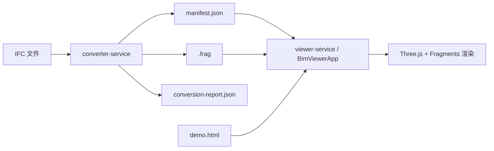

# BIM 模型 Manifest 与 Viewer SDK 设计文档

版本：v1.0
日期：2026-06-25

## 1. 设计目标

- 将模型交付从“裸 `.frag` 文件”升级为“Manifest 驱动”。
- 将 Viewer 入口从页面脚本升级为 SDK 化接口。
- 保持当前 Three.js + Fragments 的实现路线不变。

## 2. 总体架构



## 3. 模块划分

### 3.1 converter-service

职责：

- 读取 IFC
- 输出 `.frag`
- 输出 `manifest.json`
- 输出 `conversion-report.json`
- 保持当前命令行形态

目录约定：

```text
output/{modelName}/
  model.frag
  manifest.json
  conversion-report.json
```

### 3.2 viewer-service

职责：

- 托管 PC / Mobile Viewer
- 提供 Manifest 加载能力
- 暴露统一的 Viewer SDK
- 维持树、选择、属性、显隐、隔离、着色、透明度、快照、视点等能力

### 3.3 demo 页面

职责：

- 提供功能入口
- 输入 manifest URL
- 引导用户进入 Viewer
- 作为后续模型库和回归页的载体

## 4. Manifest 设计

### 4.1 Schema

```json
{
  "schemaVersion": "bim-model-manifest/v1"
}
```

### 4.2 核心字段

- `modelId`：模型逻辑 ID
- `modelVersionId`：模型版本 ID
- `displayName`：展示名称
- `source`：原始文件信息
- `resources.fragments.url`：Fragments 主资源
- `conversion`：转换信息
- `viewer`：默认视图和默认树配置

### 4.3 资源解析规则

- manifest 内资源路径以 manifest URL 为基准解析。
- `resources.fragments.url` 为必填。
- 其余资源为可选项。

## 5. Viewer SDK 设计

### 5.1 入口类

```js
BimViewerApp.create({ scene, camera, workerUrl })
```

### 5.2 主要 API

```js
await app.openModel({
  manifestUrl,
  manifest,
  fragUrl,
  file,
  buffer
})

await app.disposeModel()
await app.update(force)
app.getCurrentModel()
app.getManifest()
```

### 5.3 事件

- `loadstart`
- `progress`
- `loaded`
- `disposed`

### 5.4 行为边界

- SDK 只负责加载与释放模型资源。
- 页面层仍负责树、属性、右键菜单和按钮绑定。
- 后续可继续把选择、显隐、隔离、着色等能力收口进 SDK。

## 6. 页面设计

### 6.1 标准 Viewer

输入区：

- `.frag` 文件选择
- `.frag` URL
- manifest URL

显示区：

- 模型视窗
- 模型树
- 构件属性
- 运行日志

### 6.2 Demo Console

展示：

- Manifest 加载入口
- Viewer / Mobile 入口
- 功能清单
- 后续扩展入口

## 7. 转换输出设计

### 7.1 现阶段输出

- `model.frag`
- `manifest.json`
- `conversion-report.json`

### 7.2 后续可扩展输出

- `properties.json`
- `global-id-index.json`
- `tree-index.json`
- `snapshot-index.json`

## 8. 错误处理

- manifest schema 不匹配：直接失败。
- fragments 资源缺失：直接失败。
- manifest 拉取失败：展示 URL 和 HTTP 状态。
- frag 拉取失败：展示资源地址和错误信息。

## 9. 兼容与演进

### 9.1 向后兼容

- 旧的 `fragUrl` 加载方式保留。
- 新 manifest 加载方式与旧方式并行。

### 9.2 演进路径

1. 先支持 manifest 驱动加载。
2. 再补属性索引和 GlobalId 索引。
3. 再收口 Viewer SDK 的交互能力。
4. 最后演进为任务化转换与目录中心。

## 10. 设计结论

这套设计与当前仓库结构一致，能够在不替换渲染内核的前提下，把当前“文件加载型” Viewer 升级为“平台交付型” Viewer。
