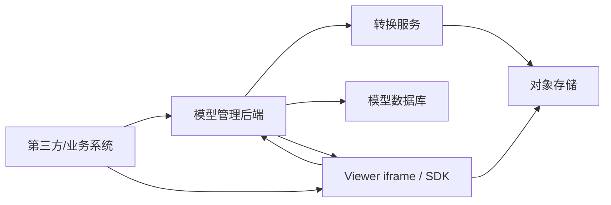

# BIM 模型文件后端存储与实现形式评估

更新时间：2026-07-16

文档状态：当前有效的后端产品化建议；对象存储和正式数据库尚未在当前项目中完整落地。

## 1. 结论

模型文件应由后端统一存储和管理，不建议长期依赖 Viewer 本地路径或前端静态目录。

推荐实现形式：

| 类型 | 推荐方案 | 说明 |
|---|---|---|
| 原始模型 | 对象存储 | 保存 IFC 原文件，用于重新转换、审计和版本追溯 |
| 转换产物 | 对象存储 | 保存 `.frag`、后续可能拆分出的 `.frag.geo`、`.frag.json` |
| Manifest | 后端生成并存储 | Viewer 只加载 manifest URL，不直接关心物理文件路径 |
| 元数据 | 数据库 | 保存模型记录、版本、转换任务、文件大小、状态、租户/项目归属 |
| 访问方式 | 后端签发 URL | 内网可用静态 URL；生产建议预签名 URL 或受控下载代理 |

当前项目已经具备基础条件：

- `converter-service` 已能生成 `.frag` 和 `manifest.json`。
- `viewer-service` 已支持通过 `manifestUrl` 加载模型。
- `docs/BIM三服务器系统架构方案.md` 已给出对象存储/MinIO 方向。

## 2. 当前问题

| 问题 | 当前表现 | 风险 |
|---|---|---|
| 文件路径偏本地化 | `converter-service/output`、`viewer-service` 静态路径 | 第三方系统无法稳定访问 |
| 模型版本未产品化 | `modelVersionId` 由转换时生成 | 缺少业务版本、审批版本、回滚关系 |
| 访问权限未闭环 | Viewer 直接 fetch URL | 不能控制租户、项目、用户权限 |
| 文件生命周期缺失 | 输出目录手工管理 | 难以清理失败任务、过期版本、大文件 |
| 业务数据绑定不完整 | 标签/批注/视点仍偏 localStorage | 后端化时需要稳定 `modelId/modelVersionId/GlobalId` |

## 3. 推荐架构



核心规则：

1. 业务系统只传 `modelId` 或 `modelVersionId`。
2. 后端根据权限返回 `manifestUrl`。
3. Viewer 只消费 manifest，不直接拼接物理存储路径。
4. `.frag` 文件访问 URL 由后端生成，可设置过期时间。
5. 标签、批注、视点后端化时统一绑定 `modelVersionId + GlobalId`，`localId` 只作为运行时辅助。

## 4. Manifest 建议扩展

当前 manifest 已有：

```json
{
  "schemaVersion": "bim-model-manifest/v1",
  "modelId": "demo",
  "modelVersionId": "demo-xxx",
  "resources": {
    "fragments": {
      "url": "model.frag",
      "format": "frag"
    }
  }
}
```

建议后端化后补充：

```json
{
  "tenantId": "tenant-001",
  "projectId": "project-001",
  "storage": {
    "provider": "minio",
    "bucket": "bim-models",
    "visibility": "signed-url"
  },
  "resources": {
    "fragments": {
      "url": "https://storage.example.com/...",
      "expiresAt": "2026-07-03T12:00:00.000Z",
      "format": "frag"
    }
  }
}
```

## 5. 后端接口建议

| 接口 | 方法 | 用途 |
|---|---|---|
| `/api/models` | `POST` | 创建模型记录并上传 IFC |
| `/api/models/{modelId}` | `GET` | 获取模型基础信息 |
| `/api/models/{modelId}/versions` | `GET` | 获取模型版本列表 |
| `/api/model-versions/{versionId}/manifest` | `GET` | 返回可给 Viewer 使用的 manifest |
| `/api/conversion-tasks` | `POST` | 发起转换任务 |
| `/api/conversion-tasks/{taskId}` | `GET` | 查询转换状态、日志、错误 |
| `/api/model-versions/{versionId}/files` | `GET` | 获取源文件和产物文件清单 |

## 6. 数据表建议

| 表 | 关键字段 |
|---|---|
| `bim_model` | `id`, `tenant_id`, `project_id`, `name`, `code`, `status`, `created_at` |
| `bim_model_version` | `id`, `model_id`, `version_no`, `source_file_id`, `frag_file_id`, `manifest_file_id`, `entity_count`, `status` |
| `bim_model_file` | `id`, `bucket`, `object_key`, `file_name`, `file_type`, `size_bytes`, `sha256` |
| `bim_conversion_task` | `id`, `model_version_id`, `status`, `started_at`, `finished_at`, `error_message`, `log_path` |

## 7. 分阶段落地

| 阶段 | 目标 | 产出 |
|---|---|---|
| F039-1 | 方案收口 | 本文档、接口草案、存储决策 |
| F039-2 | 本地 PoC | 将转换产物写入统一目录，并由后端返回 manifest URL |
| F039-3 | 对象存储 PoC | 接入 MinIO/S3，保存 IFC、`.frag`、manifest |
| F039-4 | 权限和版本 | 加入租户/项目权限、版本列表、预签名 URL |
| F039-5 | 业务数据绑定 | 标签、批注、视点改为绑定后端模型版本 |

## 8. 验收标准

| 验收项 | 通过标准 |
|---|---|
| 后端存储 | IFC、`.frag`、manifest 不再依赖前端静态目录 |
| Manifest 加载 | Viewer 通过后端返回的 manifest URL 能加载模型 |
| 权限控制 | 无权限用户不能获取有效模型文件 URL |
| 版本管理 | 同一模型可查询多个版本并加载指定版本 |
| 文件可追溯 | 能从模型版本追溯源 IFC、转换产物、转换任务 |
| 生命周期 | 失败任务和废弃版本有清理或归档策略 |

## 9. 当前状态

| 项 | 状态 |
|---|---|
| 是否需要后端存储 | 已确认需要 |
| 推荐存储形式 | 对象存储 + 数据库元数据 |
| Viewer 加载方式 | 保持 manifest URL |
| 方案可行性 | 高 |
| 剩余工作 | 后端 API、对象存储 PoC、权限、版本、业务数据后端化 |
