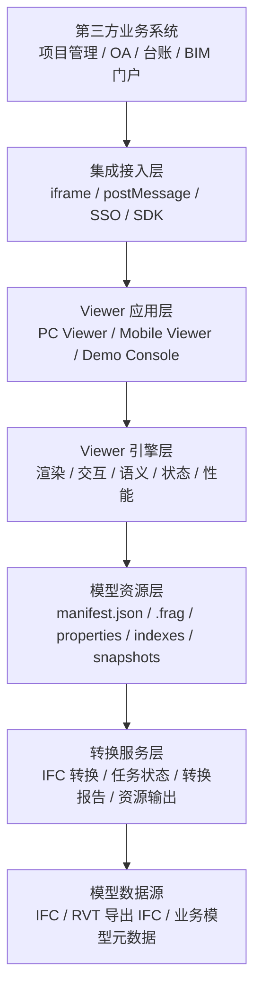
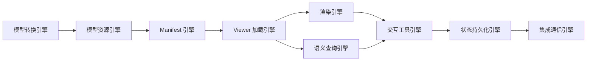
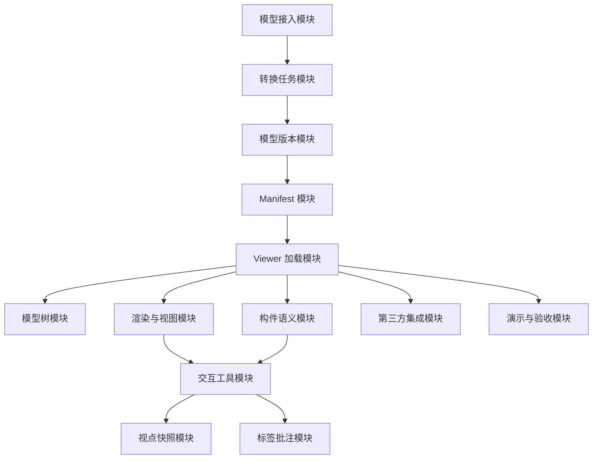
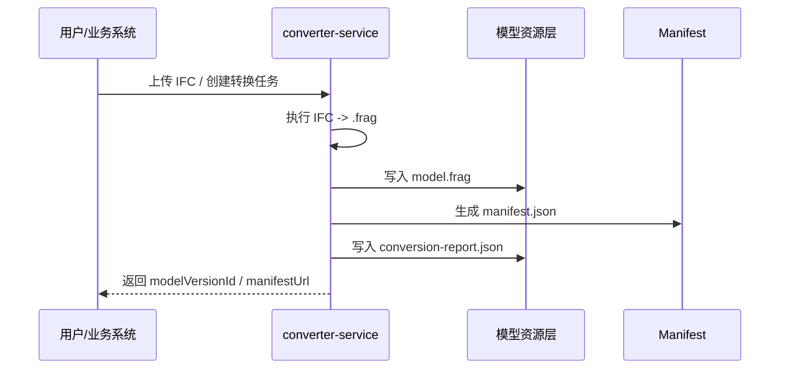
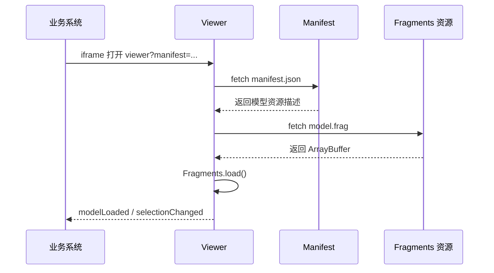
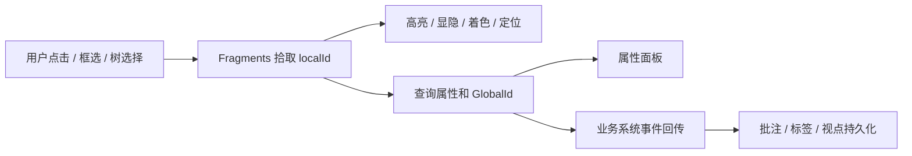

# BIM 模型系统架构、系统引擎与系统模块设计

版本：v1.0
日期：2026-06-25

## 1. 文档目标

本文基于以下两份文档，对当前 BIM Three.js + Fragments 项目进行系统级设计归纳：

- `BIM-Three与Fragments-MVP说明.md`
- `BIM-Three与Fragments架构功能扩展可行性评估.md`

本文重点回答三个问题：

1. 系统整体架构应该如何分层。
2. 模型系统内部应抽象出哪些核心引擎。
3. 后续研发应按哪些系统模块拆分和演进。

## 2. 总体技术路线

当前系统主线保持为：

```text
IFC -> Fragments .frag -> Manifest -> Three.js + @thatopen/fragments -> Viewer / iframe / SDK
```

技术路线说明：

- IFC / RVT 等原始模型不在浏览器端直接作为长期运行格式。
- 浏览器端优先消费 `.frag`，由 `@thatopen/fragments` 负责模型加载、构件查询、拾取、显隐、着色、透明、属性读取等能力。
- Three.js 负责渲染场景、相机、光照、控制器、标签、测量、剖切、后处理和扩展交互。
- Manifest 作为模型交付契约，屏蔽转换目录、资源文件和 Viewer 加载方式差异。
- 第三方系统当前优先通过 iframe 集成，后续再演进为 npm SDK。

## 3. 系统总体架构

### 3.1 架构分层



### 3.2 当前项目中的对应关系

| 架构层 | 当前对应 | 说明 |
| --- | --- | --- |
| 第三方业务系统 | 外部系统 | 通过 iframe 或后续 SDK 接入 |
| 集成接入层 | `viewer/index.html?manifest=...`、postMessage 协议 | 当前应优先完善 iframe 集成 |
| Viewer 应用层 | `viewer-service/viewer/index.html`、`mobile.html`、`demo.html` | 页面、面板、按钮和业务交互入口 |
| Viewer 引擎层 | `main-mvp.js`、`bim-viewer-app.js`、`manifest-loader.js` | 当前还混有部分页面逻辑，后续需继续拆分 |
| 模型资源层 | `.frag`、`manifest.json`、`conversion-report.json` | 后续扩展属性、索引、视点、快照资源 |
| 转换服务层 | `converter-service` | 负责 IFC 到 Fragments 及 Manifest 输出 |
| 模型数据源 | IFC / RVT 导出 IFC | RVT 原生解析暂不进入当前主线 |

## 4. 系统边界

### 4.1 当前系统负责

- 模型转换产物管理：`.frag`、`manifest.json`、转换报告。
- 浏览器端模型加载、渲染和基础交互。
- 模型树、构件选择、属性展示、显隐、隔离、着色、透明度、快照、视点等 Viewer 能力。
- 基础扩展能力：测量、捕捉、剖切、标签、批注、分区可视化、多模型管理。
- 第三方系统通过 iframe 或后续 SDK 集成。

### 4.2 当前系统不优先负责

- RVT 原生解析。
- Revit 级参数化建模。
- 完整 CAD 几何编辑器。
- 复杂族编辑。
- 高精度 2D 图纸与 3D 模型自动配准。
- 完整协同、权限、审批和流程平台。

这些能力可以作为专项系统或后续平台模块接入，不应阻塞当前 Viewer 主线。

## 5. 系统引擎设计

系统内部建议抽象为 8 个核心引擎。



### 5.1 模型转换引擎

职责：

- 接收 IFC 文件。
- 调用 Fragments 转换能力生成 `.frag`。
- 记录转换耗时、输入大小、输出大小、错误信息。
- 输出 `manifest.json` 和 `conversion-report.json`。

当前阶段能力：

- Node.js 转换脚本已可作为基础转换入口。
- 已具备输出 Manifest 的雏形。

后续建议：

- 增加 HTTP 任务接口。
- 增加任务队列、失败重试、日志归档。
- 支持完整属性转换参数验证。
- 增加转换版本号和转换参数记录，确保模型产物可追溯。

### 5.2 模型资源引擎

职责：

- 管理模型版本资源。
- 管理 `.frag`、属性文件、索引文件、快照文件。
- 屏蔽本地目录、对象存储、CDN、预签名 URL 等差异。

建议资源结构：

```text
models/{projectId}/{modelVersionId}/
  manifest.json
  model.frag
  conversion-report.json
  properties.json
  global-id-index.json
  tree-index.json
  snapshots/
```

核心原则：

- Viewer 不直接硬编码模型目录。
- Viewer 只认 Manifest 和资源 URL。
- 业务系统只认模型 ID、版本 ID 和权限。

### 5.3 Manifest 引擎

职责：

- 统一描述模型版本、资源入口、转换信息和 Viewer 默认配置。
- 对 Viewer 暴露标准加载契约。
- 支持后续扩展属性索引、GlobalId 索引、树索引、快照索引、权限和转换状态。

核心字段：

```json
{
  "schemaVersion": "bim-model-manifest/v1",
  "modelId": "demo",
  "modelVersionId": "demo-001",
  "displayName": "Demo Model",
  "resources": {
    "fragments": {
      "url": "./model.frag",
      "format": "frag"
    }
  }
}
```

设计原则：

- Manifest 是模型系统与 Viewer 的资源契约。
- Manifest 不应该包含大量业务流程字段。
- 与 Viewer 加载相关的元数据可以进入 Manifest。
- 复杂业务数据仍应由业务 API 提供。

### 5.4 Viewer 加载引擎

职责：

- 通过 `manifestUrl`、`fragUrl`、本地文件或 ArrayBuffer 加载模型。
- 统一模型加载、释放、进度、失败处理。
- 对外暴露稳定 API。

当前对应：

- `BimViewerApp.openModel(...)`
- `manifest-loader.js`

建议演进：

```js
await viewer.openModel({ manifestUrl });
await viewer.disposeModel();
viewer.getCurrentModel();
viewer.getManifest();
```

后续应继续收口：

- 多模型加载。
- 模型卸载。
- 版本切换。
- 加载缓存。
- 加载性能指标。

### 5.5 渲染引擎

职责：

- 管理 Three.js Scene、Camera、Renderer、Controls。
- 管理 Fragments 模型对象加入和移除场景。
- 管理光照、网格、背景、相机适配、标准视图。
- 管理渲染循环和性能更新。

当前能力：

- Three.js 渲染。
- OrbitControls。
- 标准视图切换。
- 模型适配。
- 快照。
- 全屏。

后续增强：

- 导航立方体。
- 轮廓线高亮。
- 多视窗。
- 后处理效果。
- FPS 与内存性能面板。

### 5.6 语义查询引擎

职责：

- 读取模型空间结构。
- 查询构件分类、楼层、属性、材质、GlobalId。
- 维护 `GlobalId`、`localId`、业务 ID 的映射关系。
- 为属性面板、搜索、过滤、分区可视化、批注和标签提供底层查询能力。

当前能力：

- `getSpatialStructure()`
- `getLocalIds()`
- `getCategories()`
- `getItemsData()`
- 基础属性面板。

后续建议：

- 把属性查询从页面脚本中拆出。
- 增加属性索引。
- 增加 GlobalId 索引。
- 增加按楼层、专业、分类的快速查询。
- 明确业务主键策略：

```text
业务主键：projectId + modelVersionId + ifcGlobalId
前端运行时：modelId + localId
调试对象：Three.js object.uuid
```

### 5.7 交互工具引擎

职责：

- 管理用户与模型交互工具。
- 包括选择、框选、右键菜单、显隐、隔离、着色、透明、定位。
- 后续扩展测量、捕捉、剖切、标签、批注、路径漫游、关键帧。

当前能力：

- 点击选择。
- 树节点选择。
- 框选。
- 右键菜单。
- 构件定位。
- 显隐、隔离、着色、透明度。

建议工具分组：

| 工具组 | 功能 |
| --- | --- |
| 选择工具 | 点击选择、树选择、框选、清空选择 |
| 显示工具 | 隐藏、显示、隔离、半透明、着色 |
| 视图工具 | 标准视图、适配、保存视点、恢复视点 |
| 测量工具 | 点到点距离、面积、角度 |
| 剖切工具 | 单剖切面、多剖切面、剖切盒 |
| 标注工具 | 三维标签、引线标签、标签点击 |
| 批注工具 | 问题、备注、截图、视点绑定 |
| 漫游工具 | 路径点、播放、暂停、速度控制 |

### 5.8 状态持久化引擎

职责：

- 保存 Viewer 状态和业务状态。
- 支持视点、快照、标签、批注、分区、模型变换、多模型组合等持久化。

建议状态类型：

```text
camera.position
camera.quaternion
camera.near
camera.far
camera.zoom
controls.target
selectedGlobalIds
hiddenGlobalIds
coloredGlobalIds
sectionPlanes
labels
annotations
snapshotImage
```

设计原则：

- 业务持久化优先使用 `GlobalId`。
- 前端临时状态可使用 `localId`。
- 跨版本恢复需建立 GlobalId 到 localId 的运行时映射。

### 5.9 集成通信引擎

职责：

- 支持第三方业务系统集成。
- 当前以 iframe + postMessage 为主。
- 后续提供 npm SDK。

当前建议：

- iframe 承载完整 Viewer 页面。
- `manifestUrl` 作为模型入口。
- `postMessage` 传递加载、选中、截图、视点等事件。

后续演进：

- 抽象 `BimViewerApp` 为独立 npm 包。
- 提供 `createViewer(container, options)`。
- 支持宿主系统深度控制模型加载、选择和工具状态。

## 6. 系统模块设计

### 6.1 模块总览



### 6.2 模型接入模块

职责：

- 管理原始模型文件。
- 支持 IFC 上传。
- 后续支持 RVT 导出 IFC 后接入。
- 记录项目、专业、楼栋、楼层、版本等基础元数据。

关键数据：

- `projectId`
- `modelId`
- `modelVersionId`
- `sourceFileName`
- `sourceFileType`
- `discipline`
- `uploadUser`
- `uploadTime`

### 6.3 转换任务模块

职责：

- 创建转换任务。
- 调用转换服务。
- 记录任务状态和失败原因。
- 产出 `.frag` 和 Manifest。

任务状态建议：

```text
uploaded
queued
converting
converted
failed
cancelled
```

### 6.4 模型版本模块

职责：

- 管理模型多版本。
- 支持版本切换、版本对比、多专业叠加。
- 维护原始文件、转换产物和业务元数据之间的关系。

后续支持：

- 当前版本。
- 历史版本。
- 专业模型组合。
- 多模型空间变换矩阵。

### 6.5 Manifest 模块

职责：

- 生成和校验 manifest。
- 为 Viewer 提供统一入口。
- 屏蔽资源路径和存储方式。

模块边界：

- 转换服务负责生成基础 manifest。
- 模型管理服务可以补充业务字段或签名资源 URL。
- Viewer 只消费标准 manifest，不依赖转换目录结构。

### 6.6 Viewer 加载模块

职责：

- 加载 manifest。
- 解析 fragments 资源。
- 创建 Fragments 模型实例。
- 触发加载事件。
- 管理模型释放。

验收标准：

- 支持 manifest 加载。
- 支持旧的 `.frag` URL 加载。
- 支持本地 `.frag` 文件调试。
- 加载失败时有清晰错误。

### 6.7 模型树模块

职责：

- 展示模型结构。
- 支持 `models`、`objects`、`classes`、`storeys`。
- 支持树节点选择并联动模型高亮。

后续优化：

- 懒加载。
- 虚拟滚动。
- 搜索过滤。
- 默认只展开少量层级。
- 大模型聚合节点。

### 6.8 构件语义模块

职责：

- 展示构件基础信息。
- 展示属性、材质、分类、GlobalId。
- 支持属性搜索和过滤。
- 支持构件 ID 与业务数据绑定。

关键风险：

- 属性完整度取决于转换阶段。
- 如果转换未保留完整属性，前端无法凭空恢复 BIM 语义。

### 6.9 渲染与视图模块

职责：

- 管理模型渲染。
- 管理相机和标准视图。
- 管理适配模型、全屏、快照。
- 后续增加导航立方体、多视窗、后处理。

当前已具备：

- Three.js 渲染。
- 标准视图。
- 适配模型。
- 快照。
- 全屏。
- 内存级视点保存和恢复。

### 6.10 构件操作模块

职责：

- 点击选择。
- 框选。
- 右键拾取。
- 定位、隐藏、隔离、着色、透明度。
- 清空选择和全部显示。

设计原则：

- UI 操作和底层操作 API 分离。
- 所有构件操作应基于 `localId` 执行。
- 与业务持久化交互时转换为 `GlobalId`。

### 6.11 测量捕捉模块

职责：

- 点到点测量。
- 捕捉点选择。
- 显示测量线和测量文本。
- 后续扩展面积、角度和构件边面捕捉。

前置条件：

- raycast / snapRaycast 在真实模型下稳定。
- 模型单位、坐标和缩放比例可靠。
- 大模型下连续拾取不卡顿。

### 6.12 剖切模块

职责：

- 创建剖切平面。
- 启用 / 禁用剖切。
- 移动剖切面。
- 清除剖切。
- 后续支持多剖切面和剖切盒。

设计建议：

- 基础版先做单剖切面。
- 剖切状态需要进入视点持久化。
- 多剖切和剖切盒后置。

### 6.13 标签批注模块

职责：

- 创建三维标签。
- 标签绑定构件或空间坐标。
- 创建模型批注。
- 批注绑定视点、截图和构件。

推荐数据主键：

- 标签绑定：`modelVersionId + GlobalId` 或 `modelVersionId + worldPosition`
- 批注绑定：`projectId + modelVersionId + GlobalId + cameraState`

### 6.14 视点快照模块

职责：

- 保存 camera state。
- 保存当前选中、隐藏、着色、剖切、标签状态。
- 保存快照图片。
- 恢复历史视点。

后续可形成：

- 视图浏览器。
- 批注快照。
- 漫游关键帧。
- 模型对比视点同步。

### 6.15 多模型与模型装配模块

职责：

- 同一项目下加载多个专业模型。
- 支持多模型叠加。
- 支持模型平移和旋转校正。
- 保存模型 transform matrix。

前置条件：

- 多专业模型坐标体系清楚。
- 优先依赖 BIM 原始坐标。
- 人工平移 / 旋转只作为补充校正能力。

### 6.16 分区可视化模块

职责：

- 按楼层、区域、专业、施工段对构件进行显隐、着色和透明。
- 支持构件统计。
- 支持业务数据映射。

依赖：

- 楼层关系。
- 区域数据。
- 专业分类。
- GlobalId 或业务构件编码。

### 6.17 第三方集成模块

职责：

- iframe 集成。
- postMessage 通信。
- SSO / Token 接入。
- Viewer 事件回传。
- 后续 npm SDK。

当前推荐：

```text
业务系统 -> iframe -> viewer/index.html?manifest=...
```

后续演进：

```text
业务系统 -> npm SDK -> createViewer(container, options)
```

### 6.18 演示与验收模块

职责：

- 提供项目功能演示页面。
- 展示标准模型库。
- 展示加载、模型树、选择、属性、显隐、测量、剖切、标签、批注等能力。
- 记录性能指标和验收结果。

建议 Demo Console 后续包含：

- 标准模型列表。
- 转换任务状态。
- 功能验收入口。
- 性能记录。
- 回归测试截图。

## 7. 数据流设计

### 7.1 转换数据流



### 7.2 Viewer 加载数据流



### 7.3 构件操作数据流



## 8. 接口边界

### 8.1 转换服务接口边界

建议后续转换服务提供：

- 创建转换任务。
- 查询转换状态。
- 获取转换报告。
- 获取 Manifest。
- 删除或归档模型资源。

不建议转换服务负责：

- Viewer 页面托管。
- 业务权限流程。
- 前端交互状态。

### 8.2 Viewer 服务接口边界

Viewer 服务负责：

- 托管 Viewer 页面。
- 加载 manifest 和 `.frag`。
- 模型交互和视觉展示。
- 对第三方系统提供 iframe/postMessage 集成。

Viewer 服务不应直接负责：

- IFC 转换。
- 项目业务流程。
- 审批协同。
- 长期业务数据持久化。

### 8.3 业务系统接口边界

业务系统负责：

- 用户、权限、项目、流程。
- 模型版本和业务数据绑定。
- 批注、问题、视点、快照等业务数据的保存。
- 通过 iframe 或 SDK 调用 Viewer。

## 9. 阶段路线

### 9.1 P0：MVP 稳定化

目标：

- 稳定当前 Viewer。
- 验证大模型加载性能。
- 验证属性完整度和 ID 稳定性。
- 优化模型树性能。
- 验证框选和右键菜单准确性。

关键任务：

- 大模型加载性能记录。
- 属性完整度对比。
- GlobalId / localId 稳定性验证。
- 模型树懒加载和虚拟滚动预研。
- 第三方 iframe 通信协议稳定。

### 9.2 P1：基础 BIM Viewer 补齐

目标：

- 完成高频 BIM Viewer 基础工具。

关键任务：

- 捕捉。
- 距离测量。
- 视点持久化。
- 三维标签。
- 基础剖切。
- 快照持久化。

### 9.3 P2：业务化能力

目标：

- 支撑项目级业务试点。

关键任务：

- 模型批注。
- 视图浏览器。
- 分区可视化。
- 多模型管理。
- 模型平移 / 旋转。
- 标签管理。

### 9.4 P3：复杂增强能力

目标：

- 提升展示、对比和复杂业务能力。

关键任务：

- 路径漫游。
- 自定义关键帧。
- 双视窗。
- 标签聚合。
- 模型版本对比。
- 图纸模型联动专项预研。

## 10. 主要风险与控制

| 风险 | 影响 | 控制措施 |
| --- | --- | --- |
| `.frag` 属性不完整 | 属性面板、标签、批注、分区无法可靠绑定 | P0 先做属性完整度验证，必要时调整转换参数 |
| 构件 ID 不稳定 | 视点、批注、问题清单跨版本失效 | 业务主键使用 GlobalId，localId 仅作为运行时 ID |
| 大模型树卡顿 | Viewer 可用性下降 | 懒加载、虚拟滚动、聚合节点、默认折叠 |
| 拾取和框选不稳定 | 选择、测量、右键菜单不可信 | 使用真实模型验证 raycast / rectangleRaycast / snapRaycast |
| 多模型坐标不一致 | 多专业叠加错误 | 优先使用 BIM 原始坐标，人工 transform 作为补充 |
| 图纸模型联动复杂 | 周期不可控 | 不进入首期，单独专项预研 |
| 业务边界扩张 | 平台复杂度失控 | Viewer 聚焦模型能力，业务流程由业务系统负责 |

## 11. 设计结论

当前系统应定位为“基于 Fragments 的 BIM 模型查看与交互引擎”，而不是完整 BIM 协同平台。

短期应优先巩固：

- IFC 到 `.frag` 的转换链路。
- Manifest 标准化。
- Viewer 加载 SDK 化。
- iframe 第三方集成。
- 大模型性能与属性完整度验证。

中期再扩展：

- 测量、剖切、标签、视点、快照、批注。
- 多模型、分区可视化、模型装配。

长期再考虑：

- npm SDK 产品化。
- 模型版本对比。
- 路径漫游和关键帧。
- 图纸模型联动专项。

按这个架构推进，可以在不替换当前 Three.js + Fragments 主线的前提下，把当前 MVP 演进为可集成、可扩展、可试点交付的 BIM 模型系统。
